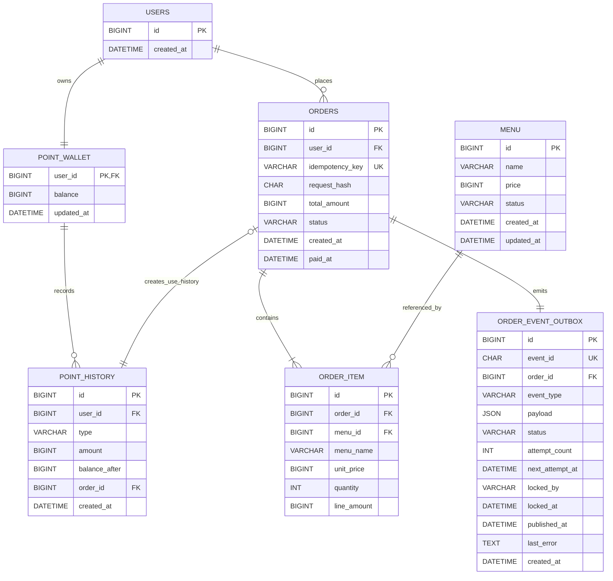

# Coffee Order System

다중 서버 환경에서 동시성, 데이터 일관성, 장애 복구를 고려하는 커피 주문 시스템 과제입니다.

현재는 요구사항 분석과 ERD 설계를 완료한 단계이며, API와 Spring Boot 코드는 이후 단계에서 구현합니다.

## 과제 범위

- 커피 메뉴 목록 조회
- 포인트 충전
- 여러 메뉴 주문 및 포인트 결제
- 주문 데이터를 외부 데이터 플랫폼으로 실시간 전송
- 현재 시각 기준 최근 168시간 인기 메뉴 TOP 3 조회
- 다중 서버 동시성, 데이터 일관성 및 테스트 고려

회원가입, 사용자 관리, 메뉴 관리, 주문 취소는 이번 과제 범위에 포함하지 않습니다. 사용자와 메뉴는 사전에 존재하며, 사용자를 생성할 때 잔액이 0P인 포인트 지갑도 함께 생성합니다.

## 핵심 정책

### 포인트

- 1원은 1P이며 모든 금액은 정수로 관리합니다.
- 한 번에 1P 이상 300,000P 이하를 충전할 수 있습니다.
- 충전 후 총잔액은 300,000P를 초과할 수 없고, 잔액은 음수가 될 수 없습니다.
- 잔액 변경과 포인트 이력 저장은 하나의 트랜잭션으로 처리합니다.
- 다중 서버 동시성은 `SELECT ... FOR UPDATE`를 이용한 DB 비관적 락으로 제어합니다.
- 외부 API는 포인트 지갑 락을 보유한 트랜잭션 안에서 호출하지 않습니다.

### 주문

- 한 주문에 여러 메뉴와 메뉴별 수량을 입력할 수 있습니다.
- 수량은 1 이상이며, 한 요청에 같은 메뉴 ID가 중복되면 `400 Bad Request`로 실패합니다.
- 메뉴가 없거나 판매 중지된 항목이 하나라도 있으면 전체 주문을 실패시킵니다.
- 결제 금액은 클라이언트 입력이 아닌 DB의 메뉴 가격으로 계산합니다.
- 결제 후 잔액이 0P가 되는 것은 허용합니다.
- 주문, 주문 항목, 포인트 차감, 포인트 사용 이력, Outbox 이벤트가 하나의 DB 트랜잭션으로 커밋되어야 주문이 성공합니다.
- 주문 항목에는 주문 당시 메뉴명, 단가, 수량 및 항목 금액을 스냅샷으로 저장합니다.

### 주문 멱등성

- 주문 API의 `Idempotency-Key` 헤더는 필수입니다.
- 별도의 멱등성 테이블을 두지 않고 `orders`에 멱등 키와 요청 해시를 저장합니다.
- `(user_id, idempotency_key)` 유니크 제약을 최종 방어선으로 사용합니다.
- 메뉴 ID로 정렬한 `menuId`와 `quantity` 목록을 canonical payload로 만들고 SHA-256 해시를 저장합니다.
- 같은 키와 같은 요청이면 새 결제 없이 기존 주문 결과를 반환합니다.
- 같은 키와 다른 요청이면 `409 Conflict`와 `IDEMPOTENCY_KEY_REUSED` 오류를 반환합니다.
- 같은 키의 동시 요청은 선행 트랜잭션이 끝날 때까지 DB 유니크 인덱스에서 대기합니다. 충돌이 확인되면 현재 트랜잭션을 롤백하고 새 트랜잭션에서 기존 주문과 요청 해시를 조회합니다.
- 선행 요청이 롤백되면 멱등성 행도 남지 않으므로 후행 요청이 정상적으로 주문을 처리할 수 있습니다.

### 외부 데이터 플랫폼

- Transactional Outbox 패턴을 사용합니다.
- 주문 트랜잭션에서는 외부 API를 호출하지 않고 Outbox 이벤트까지만 저장합니다.
- 별도 게시자가 커밋된 이벤트를 외부 플랫폼으로 전송합니다.
- 전달 의미는 at-least-once이며, 소비자는 `eventId`로 중복 이벤트를 제거해야 합니다.
- 2xx는 이벤트 전송 성공으로 처리하지만 주문 성공 조건에는 영향을 주지 않습니다.
- 4xx는 재시도하지 않는 데이터 오류로 보고 `FAILED`로 전환합니다.
- 네트워크 오류와 5xx는 지수 백오프로 최초 실패 후 최대 5회 재시도합니다. 최초 전송을 포함한 최대 시도 횟수는 6회이며, 모두 실패하면 `FAILED`로 전환합니다.

### 인기 메뉴

- 조회 시각 `T`를 한 번만 고정합니다.
- `[T - 168시간, T)` 범위의 `PAID` 주문만 집계합니다.
- `SUM(order_item.quantity)`로 메뉴별 판매 수량을 계산합니다.
- 판매 수량 내림차순, 동률이면 메뉴 ID 오름차순으로 정렬하여 최대 3개를 반환합니다.
- 데이터가 없으면 빈 목록을 반환합니다.
- 현재 시각은 직접 호출하지 않고 테스트에서 교체할 수 있는 `Clock`을 주입합니다.

## ERD



## 테이블 설계

금액은 Java `long`, MySQL `BIGINT`를 사용합니다. 현재 한도는 `int` 범위 안이지만 주문 합계와 향후 정책 확장에서 발생할 수 있는 오버플로를 줄이고 도메인 전체의 금액 타입을 통일하기 위한 선택입니다.

### `users`

| 컬럼 | 타입 | 제약 | 설명 |
| --- | --- | --- | --- |
| `id` | `BIGINT` | PK | 사용자 식별자 |
| `created_at` | `DATETIME(6)` | NOT NULL | 생성 시각 |

사용자 생성 트랜잭션에서 잔액 0P의 `point_wallet`도 함께 생성합니다. FK만으로 모든 사용자에게 지갑이 반드시 존재한다는 역방향 조건을 강제할 수 없으므로 애플리케이션 생성 흐름과 초기 데이터 검증으로 이 불변식을 보장합니다.

### `point_wallet`

| 컬럼 | 타입 | 제약 | 설명 |
| --- | --- | --- | --- |
| `user_id` | `BIGINT` | PK, FK | 사용자 및 지갑 식별자 |
| `balance` | `BIGINT` | NOT NULL, DEFAULT 0 | 현재 잔액 |
| `updated_at` | `DATETIME(6)` | NOT NULL | 마지막 변경 시각 |

- `CHECK (balance BETWEEN 0 AND 300000)`
- `FOREIGN KEY (user_id) REFERENCES users(id) ON DELETE RESTRICT`
- 비관적 락을 사용하므로 현재 설계에는 낙관적 락용 `version` 컬럼을 두지 않습니다.

### `point_history`

| 컬럼 | 타입 | 제약 | 설명 |
| --- | --- | --- | --- |
| `id` | `BIGINT` | PK | 이력 식별자 |
| `user_id` | `BIGINT` | FK, NOT NULL | 지갑 소유 사용자 |
| `type` | `VARCHAR(20)` | NOT NULL | `CHARGE`, `USE` |
| `amount` | `BIGINT` | NOT NULL | 충전은 양수, 사용은 음수 |
| `balance_after` | `BIGINT` | NOT NULL | 변경 직후 잔액 |
| `order_id` | `BIGINT` | FK, NULL 허용, UNIQUE | 사용 이력의 주문 |
| `created_at` | `DATETIME(6)` | NOT NULL | 잔액 변경 시각 |

- `CHARGE`이면 `amount > 0`, `order_id IS NULL`이어야 합니다.
- `USE`이면 `amount < 0`, `order_id IS NOT NULL`이어야 합니다.
- `CHECK (balance_after BETWEEN 0 AND 300000)`을 적용합니다.
- `UNIQUE (order_id)`로 한 주문에 포인트 사용 이력이 중복 생성되는 것을 방지합니다. MySQL 유니크 인덱스는 여러 `NULL`을 허용하므로 충전 이력에는 영향을 주지 않습니다.
- `FOREIGN KEY (user_id) REFERENCES point_wallet(user_id) ON DELETE RESTRICT`
- `FOREIGN KEY (order_id) REFERENCES orders(id) ON DELETE RESTRICT`

### `menu`

| 컬럼 | 타입 | 제약 | 설명 |
| --- | --- | --- | --- |
| `id` | `BIGINT` | PK | 메뉴 식별자 |
| `name` | `VARCHAR(100)` | NOT NULL | 현재 메뉴명 |
| `price` | `BIGINT` | NOT NULL | 현재 판매 가격 |
| `status` | `VARCHAR(20)` | NOT NULL | `ON_SALE`, `STOPPED` |
| `created_at` | `DATETIME(6)` | NOT NULL | 생성 시각 |
| `updated_at` | `DATETIME(6)` | NOT NULL | 수정 시각 |

- `CHECK (price >= 1)`
- `CHECK (status IN ('ON_SALE', 'STOPPED'))`

### `orders`

| 컬럼 | 타입 | 제약 | 설명 |
| --- | --- | --- | --- |
| `id` | `BIGINT` | PK | 주문 식별자 |
| `user_id` | `BIGINT` | FK, NOT NULL | 주문 사용자 |
| `idempotency_key` | `VARCHAR(255)` | NOT NULL | 주문 멱등 키 |
| `request_hash` | `CHAR(64)` | NOT NULL | canonical request의 SHA-256 |
| `total_amount` | `BIGINT` | NOT NULL | 서버가 계산한 주문 총액 |
| `status` | `VARCHAR(20)` | NOT NULL | 현재 범위에서는 `PAID` |
| `created_at` | `DATETIME(6)` | NOT NULL | 주문 생성 시각 |
| `paid_at` | `DATETIME(6)` | NOT NULL | 결제 완료 시각 |

- `UNIQUE (user_id, idempotency_key)`
- `CHECK (total_amount >= 1)`
- `CHECK (status = 'PAID')`
- `FOREIGN KEY (user_id) REFERENCES users(id) ON DELETE RESTRICT`
- `idempotency_key`에는 대소문자를 구분하는 `utf8mb4_bin` 계열 collation을 적용합니다.
- 현재 주문 트랜잭션은 완료 상태만 커밋하므로 `PENDING`을 저장하지 않습니다. 취소 기능이 추가되면 상태 모델을 확장합니다.

### `order_item`

| 컬럼 | 타입 | 제약 | 설명 |
| --- | --- | --- | --- |
| `id` | `BIGINT` | PK | 주문 항목 식별자 |
| `order_id` | `BIGINT` | FK, NOT NULL | 주문 식별자 |
| `menu_id` | `BIGINT` | FK, NOT NULL | 원본 메뉴 식별자 |
| `menu_name` | `VARCHAR(100)` | NOT NULL | 주문 당시 메뉴명 |
| `unit_price` | `BIGINT` | NOT NULL | 주문 당시 단가 |
| `quantity` | `INT` | NOT NULL | 주문 수량 |
| `line_amount` | `BIGINT` | NOT NULL | 단가와 수량을 곱한 금액 |

- `UNIQUE (order_id, menu_id)`
- `CHECK (unit_price >= 1)`
- `CHECK (quantity >= 1)`
- `CHECK (line_amount = unit_price * quantity)`
- `FOREIGN KEY (order_id) REFERENCES orders(id) ON DELETE RESTRICT`
- `FOREIGN KEY (menu_id) REFERENCES menu(id) ON DELETE RESTRICT`

### `order_event_outbox`

| 컬럼 | 타입 | 제약 | 설명 |
| --- | --- | --- | --- |
| `id` | `BIGINT` | PK | 내부 식별자 |
| `event_id` | `CHAR(36)` | UNIQUE, NOT NULL | 소비자 중복 제거용 UUID |
| `order_id` | `BIGINT` | FK, NOT NULL | 주문 식별자 |
| `event_type` | `VARCHAR(50)` | NOT NULL | `ORDER_COMPLETED` |
| `payload` | `JSON` | NOT NULL | 외부 전송 데이터 |
| `status` | `VARCHAR(20)` | NOT NULL | `PENDING`, `PROCESSING`, `PUBLISHED`, `FAILED` |
| `attempt_count` | `INT` | NOT NULL, DEFAULT 0 | 실제 전송 시도 횟수 |
| `next_attempt_at` | `DATETIME(6)` | NOT NULL | 다음 재시도 가능 시각 |
| `locked_by` | `VARCHAR(100)` | NULL 허용 | 선점한 게시자 식별자 |
| `locked_at` | `DATETIME(6)` | NULL 허용 | 선점 시각 |
| `published_at` | `DATETIME(6)` | NULL 허용 | 전송 완료 시각 |
| `last_error` | `TEXT` | NULL 허용 | 마지막 실패 원인 |
| `created_at` | `DATETIME(6)` | NOT NULL | 이벤트 생성 시각 |

- `UNIQUE (event_id)`
- `UNIQUE (order_id, event_type)`
- `CHECK (attempt_count BETWEEN 0 AND 6)`
- `FOREIGN KEY (order_id) REFERENCES orders(id) ON DELETE RESTRICT`

게시자는 짧은 DB 트랜잭션에서 다음 조건의 이벤트를 `FOR UPDATE SKIP LOCKED`로 조회하여 다중 인스턴스 간 중복 선점을 방지합니다.

```sql
SELECT id
FROM order_event_outbox
WHERE status = 'PENDING'
  AND next_attempt_at <= UTC_TIMESTAMP(6)
ORDER BY created_at, id
LIMIT :batch_size
FOR UPDATE SKIP LOCKED;
```

선점한 행을 `PROCESSING`으로 변경하고 `locked_by`, `locked_at`을 기록한 뒤 트랜잭션을 커밋합니다. 외부 API는 커밋 후 호출합니다. 게시자가 중단되어 `PROCESSING` 상태가 오래 유지되면 lease timeout을 기준으로 다시 `PENDING`으로 회수합니다.

외부 플랫폼이 이벤트를 수신한 직후 게시자가 종료되면 같은 이벤트가 다시 전송될 수 있습니다. 따라서 게시자는 매번 같은 `event_id`를 사용하고, Mock API 테스트에서도 소비자의 중복 제거를 검증합니다.

## 인덱스

| 테이블 | 인덱스 | 목적 |
| --- | --- | --- |
| `orders` | `UNIQUE (user_id, idempotency_key)` | 사용자별 멱등성 보장 |
| `orders` | `INDEX (status, paid_at, id)` | 최근 168시간 결제 주문 범위 탐색 |
| `order_item` | `UNIQUE (order_id, menu_id)` | 주문 내 메뉴 중복 방지 |
| `order_item` | `INDEX (order_id, menu_id, quantity)` | 인기 메뉴 조인 및 수량 집계 |
| `point_history` | `UNIQUE (order_id)` | 주문별 중복 차감 방지 |
| `point_history` | `INDEX (user_id, created_at, id)` | 사용자 포인트 이력 조회 |
| `order_event_outbox` | `UNIQUE (event_id)` | 이벤트 식별자 중복 방지 |
| `order_event_outbox` | `UNIQUE (order_id, event_type)` | 주문 이벤트 중복 생성 방지 |
| `order_event_outbox` | `INDEX (status, next_attempt_at, created_at, id)` | 전송 대상 배치 조회 |
| `order_event_outbox` | `INDEX (status, locked_at)` | 만료된 `PROCESSING` 이벤트 회수 |

실제 인덱스 사용 여부는 MySQL 실행 계획과 통합 테스트 데이터로 확인하고, 중복되거나 사용되지 않는 인덱스는 구현 단계에서 조정합니다.

## 시간 저장 기준

- 애플리케이션에서는 `Instant`를 사용합니다.
- DB에는 UTC 기준 `DATETIME(6)`으로 저장합니다.
- JDBC와 Hibernate의 시간대도 UTC로 고정합니다.
- 인기 메뉴 조회는 주입된 `Clock`에서 `T`를 한 번 얻고 `T - 168시간`과 `T`를 UTC 값으로 변환하여 쿼리에 전달합니다.
- `Asia/Seoul`은 API 표현과 정책 설명의 기준으로 사용하되 DB 서버나 세션의 암묵적인 시간대 변환에는 의존하지 않습니다.

## 주요 오류 정책

| 상황 | HTTP 상태 | 오류 코드 예시 |
| --- | --- | --- |
| 사용자 또는 메뉴 없음 | 404 | `USER_NOT_FOUND`, `MENU_NOT_FOUND` |
| 빈 주문, 중복 메뉴, 수량 오류 | 400 | `INVALID_ORDER_REQUEST` |
| 충전 금액 오류 | 400 | `INVALID_CHARGE_AMOUNT` |
| 멱등 키 누락 | 400 | `IDEMPOTENCY_KEY_REQUIRED` |
| 판매 중지 메뉴 | 409 | `MENU_NOT_ON_SALE` |
| 포인트 총잔액 한도 초과 | 409 | `POINT_LIMIT_EXCEEDED` |
| 포인트 부족 | 409 | `INSUFFICIENT_POINTS` |
| 같은 멱등 키의 다른 요청 | 409 | `IDEMPOTENCY_KEY_REUSED` |

외부 플랫폼 전송 실패는 완료된 주문의 HTTP 응답이나 DB 상태를 롤백하지 않습니다.

## 다음 단계

1. API 요청·응답 및 오류 명세 작성
2. 동시성·트랜잭션·Outbox 상세 흐름 검토
3. Spring Boot 프로젝트 기본 구조 구성
4. 기능별 구현과 단위·통합·동시성 테스트
5. MySQL과 Testcontainers 기반 최종 검증
