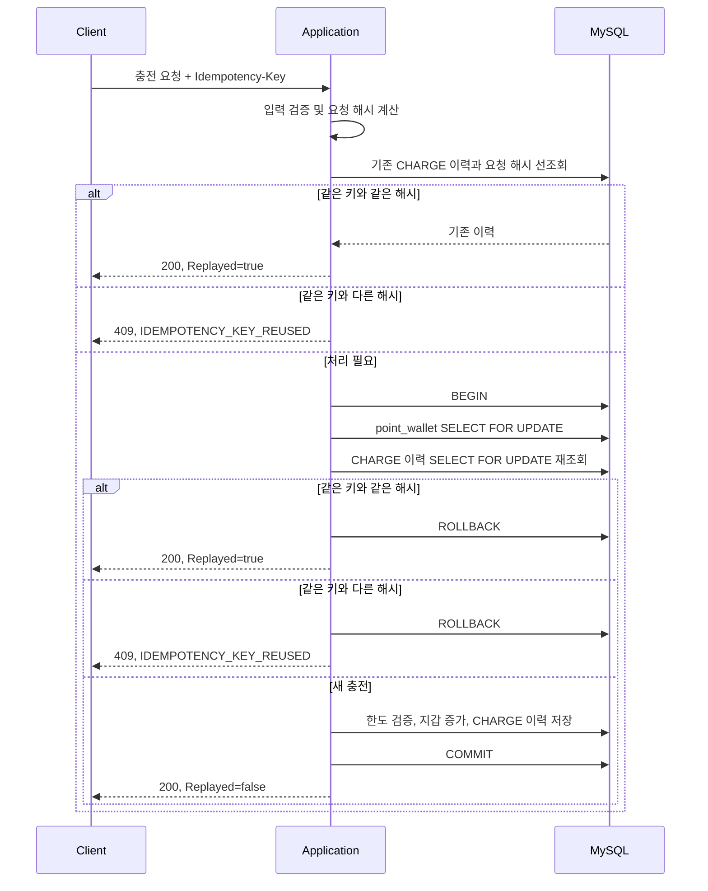
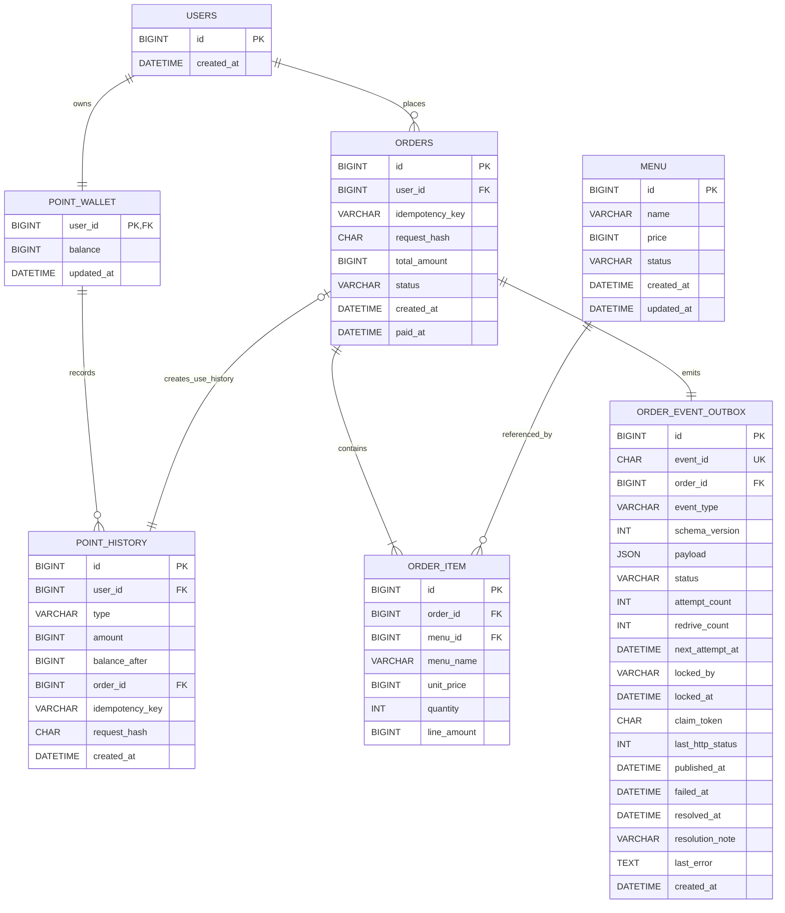
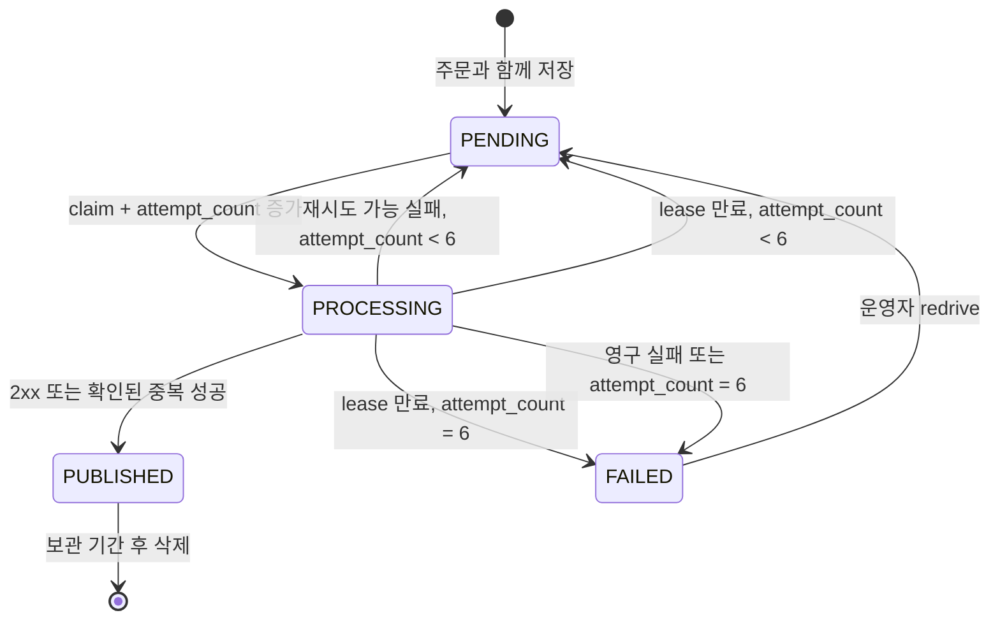

# Coffee Order System

다중 서버 환경에서 동시성, 데이터 일관성, 장애 복구를 고려하는 커피 주문 시스템 과제입니다.

현재는 요구사항 분석, ERD, API 명세와 동시성·트랜잭션·Outbox 상세 전략을 완료한 단계이며, Spring Boot 코드는 이후 단계에서 구현합니다.

## 설계 목표와 의도

이 시스템의 핵심 목표는 다중 서버 환경에서 같은 사용자의 요청이 동시에 처리되더라도 포인트가 중복 사용되거나 주문, 포인트 이력과 외부 전송 대상 데이터가 서로 어긋나지 않도록 하는 것입니다.

포인트와 주문처럼 즉시 일관성이 필요한 데이터는 하나의 DB 트랜잭션과 DB 락으로 보호합니다. 반면 외부 데이터 플랫폼은 네트워크 장애와 응답 지연이 내부 주문 성공에 영향을 주지 않도록 Transactional Outbox로 분리합니다. 이 경계 안에서 다음 원칙을 지킵니다.

- 금액 계산과 상태 변경의 최종 판단은 클라이언트가 아니라 서버와 DB가 담당합니다.
- 주문, 포인트 차감, 이력과 Outbox 이벤트는 함께 성공하거나 함께 실패합니다.
- 재요청과 중복 전송은 정상적으로 발생할 수 있다고 보고 멱등성과 소비자 중복 제거를 설계합니다.
- 동시성 제어는 특정 JVM에 의존하지 않고 모든 서버 인스턴스가 공유하는 DB를 기준으로 수행합니다.
- 데이터 저장 시각은 UTC로 통일하고 한국 사용자가 보는 API 시각은 `Asia/Seoul`로 표현합니다.
- 테스트에서 경계 시각, 동시 요청과 외부 장애를 재현할 수 있도록 설계합니다.

## 과제 범위

- 커피 메뉴 목록 조회
- 포인트 충전
- 여러 메뉴 주문 및 포인트 결제
- 주문 데이터를 외부 데이터 플랫폼으로 실시간 전송
- 현재 시각 기준 최근 168시간 인기 메뉴 TOP 3 조회
- 다중 서버 동시성, 데이터 일관성 및 테스트 고려

회원가입, 사용자 관리, 메뉴 관리, 주문 취소는 이번 과제 범위에 포함하지 않습니다. 사용자와 메뉴는 사전에 존재하며, 사용자를 생성할 때 잔액이 0P인 포인트 지갑도 함께 생성합니다.

## 핵심 정책

### 포인트

- 1원은 1P이며 모든 금액은 정수로 관리합니다.
- 한 번에 1P 이상 300,000P 이하를 충전할 수 있습니다.
- 충전 후 총잔액은 300,000P를 초과할 수 없고, 잔액은 음수가 될 수 없습니다.
- 잔액 변경과 포인트 이력 저장은 하나의 트랜잭션으로 처리합니다.
- 다중 서버 동시성은 `SELECT ... FOR UPDATE`를 이용한 DB 비관적 락으로 제어합니다.
- 충전 API도 `Idempotency-Key`를 필수로 받아 응답 유실 후 재요청으로 같은 금액이 중복 충전되는 것을 방지합니다.
- 충전 멱등 키와 `amount`의 SHA-256 요청 해시는 `point_history`의 `CHARGE` 이력에 저장합니다.
- 외부 API는 포인트 지갑 락을 보유한 트랜잭션 안에서 호출하지 않습니다.

### 주문

- 한 주문에 여러 메뉴와 메뉴별 수량을 입력할 수 있습니다.
- 수량은 1 이상이며, 한 요청에 같은 메뉴 ID가 중복되면 `400 Bad Request`로 실패합니다.
- 메뉴가 없거나 판매 중지된 항목이 하나라도 있으면 전체 주문을 실패시킵니다.
- 결제 금액은 클라이언트 입력이 아닌 DB의 메뉴 가격으로 계산합니다.
- 결제 후 잔액이 0P가 되는 것은 허용합니다.
- 주문, 주문 항목, 포인트 차감, 포인트 사용 이력, Outbox 이벤트가 하나의 DB 트랜잭션으로 커밋되어야 주문이 성공합니다.
- 주문 항목에는 주문 당시 메뉴명, 단가, 수량 및 항목 금액을 스냅샷으로 저장합니다.

### 주문 멱등성

- 주문 API의 `Idempotency-Key` 헤더는 필수입니다.
- 별도의 멱등성 테이블을 두지 않고 `orders`에 멱등 키와 요청 해시를 저장합니다.
- `(user_id, idempotency_key)` 유니크 제약을 최종 방어선으로 사용합니다.
- 메뉴 ID로 정렬한 `menuId`와 `quantity` 목록을 canonical payload로 만들고 SHA-256 해시를 저장합니다.
- 같은 키와 같은 요청이면 새 결제 없이 기존 주문 결과를 반환합니다.
- 같은 키와 다른 요청이면 `409 Conflict`와 `IDEMPOTENCY_KEY_REUSED` 오류를 반환합니다.
- 같은 사용자의 주문과 충전은 모두 지갑 행을 먼저 잠근 뒤 멱등 결과를 다시 확인하여 사용자별로 직렬화합니다.
- 유니크 제약 충돌이 발생하면 예외가 난 트랜잭션에서 조회를 계속하지 않고 전체 롤백 후 새 읽기 전용 트랜잭션에서 기존 결과를 조회합니다.
- 멱등 키의 범위는 `사용자 + API 작업 종류`입니다. 충전과 주문은 서로 다른 테이블에 저장하므로 문자열이 우연히 같아도 서로 충돌하지 않지만, 클라이언트는 모든 변경 요청에 새 UUID를 사용합니다.
- 주문과 충전의 멱등 키는 각 도메인 테이블에 영구 보관합니다. 실패 결과나 처리 중 상태, 키 만료까지 저장해야 한다면 별도 멱등성 테이블로 확장합니다.

### 외부 데이터 플랫폼

- Transactional Outbox 패턴을 사용합니다.
- 주문 트랜잭션에서는 외부 API를 호출하지 않고 Outbox 이벤트까지만 저장합니다.
- 별도 게시자가 커밋된 이벤트를 외부 플랫폼으로 전송합니다.
- 전송 성공 전까지 같은 이벤트가 중복 전달될 수 있는 at-least-once 시도 모델을 사용하며, 소비자는 `eventId`로 중복 이벤트를 제거해야 합니다.
- 최대 시도 후 `FAILED`가 된 이벤트는 운영자 redrive가 필요하므로 외부 플랫폼이 영구 장애인 상황까지 자동으로 최종 전달을 보장한다고 표현하지 않습니다.
- 2xx는 이벤트 전송 성공으로 처리하지만 주문 성공 조건에는 영향을 주지 않습니다.
- 네트워크 오류, timeout, 재시도 가능한 4xx와 5xx는 지수 백오프와 jitter로 최초 실패 후 최대 5회 재시도합니다. 최초 전송을 포함한 최대 시도 횟수는 6회입니다.
- 4xx는 상태군만으로 일괄 처리하지 않고 외부 플랫폼 계약과 오류 코드를 기준으로 재시도, 성공 또는 영구 실패를 구분합니다.

### 인기 메뉴

- 조회 시각 `T`를 한 번만 고정합니다.
- `[T - 168시간, T)` 범위의 `PAID` 주문만 집계합니다.
- `SUM(order_item.quantity)`로 메뉴별 판매 수량을 계산합니다.
- 판매 수량 내림차순, 동률이면 메뉴 ID 오름차순으로 정렬하여 최대 3개를 반환합니다.
- 데이터가 없으면 빈 목록을 반환합니다.
- 현재 시각은 직접 호출하지 않고 테스트에서 교체할 수 있는 `Clock`을 주입합니다.

## API 명세

### 공통 규칙

- 기본 경로는 `/api`이며 현재 과제에서는 URL 버전을 포함하지 않습니다. 경로가 단순한 대신 향후 호환되지 않는 변경이 생기면 새 경로나 헤더 기반 버전 전략을 별도로 도입해야 합니다.
- 사용자 인증은 과제 범위 밖이므로 사용자 식별자는 경로의 `{userId}`로 전달합니다.
- 실제 운영 서비스에서는 경로 값만 신뢰하지 않고 인증 principal의 사용자 ID와 대조하여 다른 사용자의 자원에 접근하지 못하게 해야 합니다.
- `{userId}`는 1 이상의 정수여야 하며 형식이 잘못되면 `400 Bad Request`와 `INVALID_USER_ID`를 반환합니다.
- 요청과 응답은 `application/json`이며 JSON 필드명은 `camelCase`를 사용합니다.
- JSON 문법을 해석할 수 없으면 `400 MALFORMED_JSON`, JSON 변경 API에 지원하지 않는 `Content-Type`을 보내면 `415 UNSUPPORTED_MEDIA_TYPE`을 반환합니다.
- ID, 수량과 금액은 JSON 정수로 표현합니다. 금액 단위는 원이자 포인트입니다. 공개 웹 API로 확장되어 `BIGINT` ID가 JavaScript 안전 정수 범위를 넘을 수 있다면 ID 문자열 반환을 검토합니다.
- 성공 응답은 공통 래퍼 없이 각 API의 결과를 직접 반환합니다.
- API 시간은 ISO 8601 형식과 한국시간 오프셋을 포함하여 `2026-07-14T15:30:00+09:00`처럼 반환합니다.
- 서버 내부와 DB에는 동일한 시각을 UTC로 저장하고 API 경계에서 `Asia/Seoul`로 변환합니다.
- `Idempotency-Replayed`는 이 API에서 정의한 사용자 지정 응답 헤더입니다. 최초 반영은 `false`, 기존 결과 재현은 `true`이며 이를 모르는 클라이언트도 응답 본문을 정상적으로 처리할 수 있어야 합니다.

공통 오류 응답은 다음 형식을 사용합니다. 클라이언트 분기는 번역될 수 있는 `message`가 아니라 `code`를 사용합니다. `details`는 필드 오류처럼 추가 정보가 있을 때 사용하고, 없으면 빈 객체를 반환하며 `traceId`는 서버 로그와 요청을 연결하는 식별자입니다.

```json
{
  "code": "INVALID_CHARGE_AMOUNT",
  "message": "충전 금액은 1P 이상 300,000P 이하여야 합니다.",
  "details": {
    "field": "amount",
    "rejectedValue": 0
  },
  "traceId": "0af7651916cd43dd8448eb211c80319c"
}
```

현재 과제에서는 도메인 오류 코드가 간단히 드러나는 자체 형식을 사용합니다. 외부 공개 API 간 표준 상호운용성이 중요해지면 [RFC 9457](https://www.rfc-editor.org/rfc/rfc9457.html)의 `application/problem+json` 형식으로 확장할 수 있습니다. 오류 응답과 로그에는 토큰, 비밀번호와 내부 스택 트레이스 같은 민감정보를 포함하지 않습니다.

### API 목록

| 기능 | Method | URI |
| --- | --- | --- |
| 메뉴 목록 조회 | `GET` | `/api/menus` |
| 포인트 충전 | `POST` | `/api/users/{userId}/points/charges` |
| 여러 메뉴 주문 및 포인트 결제 | `POST` | `/api/users/{userId}/orders` |
| 최근 168시간 인기 메뉴 TOP 3 | `GET` | `/api/menus/popular` |

Outbox 게시와 외부 데이터 플랫폼 수신은 클라이언트 공개 API가 아니라 내부 비동기 처리 및 테스트용 Mock 영역으로 구분합니다.

### 메뉴 목록 조회

판매 중지 메뉴를 포함한 전체 메뉴를 ID 오름차순으로 반환합니다. 과제에서 메뉴 수가 제한적이고 페이지네이션 요구가 없으므로 현재는 페이지네이션을 적용하지 않습니다.

```http
GET /api/menus
```

성공 응답: `200 OK`

```json
[
  {
    "menuId": 1,
    "name": "아메리카노",
    "price": 4500,
    "status": "ON_SALE"
  },
  {
    "menuId": 2,
    "name": "카페라테",
    "price": 5000,
    "status": "ON_SALE"
  },
  {
    "menuId": 3,
    "name": "디카페인 아메리카노",
    "price": 5000,
    "status": "STOPPED"
  }
]
```

메뉴가 없으면 `200 OK`와 빈 배열을 반환합니다.

### 포인트 충전

`userId`는 1 이상의 정수이고 `amount`는 1P 이상 300,000P 이하의 정수여야 합니다. 충전 후 잔액이 300,000P를 초과하면 전체 요청을 실패시킵니다. `Idempotency-Key`는 공백이 아닌 1자 이상 255자 이하의 필수 헤더입니다.

```http
POST /api/users/1/points/charges
Content-Type: application/json
Idempotency-Key: f64e1530-e93b-40ce-a6e6-886d89d5fbbc
```

```json
{
  "amount": 10000
}
```

최초 성공 응답: `200 OK`, `Idempotency-Replayed: false`

```json
{
  "userId": 1,
  "chargedAmount": 10000,
  "balance": 25000,
  "chargedAt": "2026-07-14T15:30:00+09:00"
}
```

`amount`만 포함한 canonical payload의 SHA-256을 저장합니다. 같은 키와 같은 금액을 다시 보내면 새 충전 없이 `200 OK`, `Idempotency-Replayed: true`와 최초 `point_history.balance_after`, `created_at`으로 복원한 응답을 반환합니다. 같은 키와 다른 금액이면 `409 Conflict`로 실패합니다.

| 조건 | HTTP 상태 | 오류 코드 |
| --- | --- | --- |
| 사용자 ID 형식 오류 | `400` | `INVALID_USER_ID` |
| 멱등 키 누락 | `400` | `IDEMPOTENCY_KEY_REQUIRED` |
| 멱등 키 길이 또는 형식 오류 | `400` | `INVALID_IDEMPOTENCY_KEY` |
| 충전 금액 형식·범위 오류 | `400` | `INVALID_CHARGE_AMOUNT` |
| 사용자 없음 | `404` | `USER_NOT_FOUND` |
| 충전 후 총잔액 한도 초과 | `409` | `POINT_LIMIT_EXCEEDED` |
| 같은 멱등 키와 다른 금액 | `409` | `IDEMPOTENCY_KEY_REUSED` |
| DB 락·데드락 재시도 소진 | `503` | `CONCURRENT_REQUEST_TIMEOUT` |

### 여러 메뉴 주문 및 포인트 결제

`Idempotency-Key`는 공백이 아닌 1자 이상 255자 이하의 필수 헤더이며 사용자별로 유일합니다. 요청에는 메뉴 ID와 수량만 포함하고 가격은 서버가 DB에서 조회하여 계산합니다.

```http
POST /api/users/1/orders
Content-Type: application/json
Idempotency-Key: 3f83e46e-29ae-4bab-93da-c06c4396e012
```

```json
{
  "items": [
    {
      "menuId": 1,
      "quantity": 2
    },
    {
      "menuId": 2,
      "quantity": 1
    }
  ]
}
```

최초 성공 응답: `201 Created`, `Idempotency-Replayed: false`

```json
{
  "orderId": 101,
  "userId": 1,
  "status": "PAID",
  "totalAmount": 14000,
  "balanceAfter": 11000,
  "items": [
    {
      "menuId": 1,
      "menuName": "아메리카노",
      "unitPrice": 4500,
      "quantity": 2,
      "lineAmount": 9000
    },
    {
      "menuId": 2,
      "menuName": "카페라테",
      "unitPrice": 5000,
      "quantity": 1,
      "lineAmount": 5000
    }
  ],
  "paidAt": "2026-07-14T15:35:00+09:00"
}
```

같은 키와 같은 정규화 요청을 다시 보내면 새 주문이나 포인트 차감 없이 `200 OK`, `Idempotency-Replayed: true`와 기존 주문 응답을 반환합니다. 재현 응답의 `balanceAfter`는 현재 지갑이 아니라 해당 주문의 `USE point_history.balance_after`, `paidAt`은 `orders.paid_at`, 항목은 `order_item` 스냅샷에서 복원합니다. 동시에 도착한 같은 요청도 선행 트랜잭션이 완료된 뒤 같은 규칙을 적용합니다. 별도의 `PROCESSING` 응답은 사용하지 않습니다.

| 조건 | HTTP 상태 | 오류 코드 |
| --- | --- | --- |
| 사용자 ID 형식 오류 | `400` | `INVALID_USER_ID` |
| 멱등 키 누락 | `400` | `IDEMPOTENCY_KEY_REQUIRED` |
| 멱등 키 길이 또는 형식 오류 | `400` | `INVALID_IDEMPOTENCY_KEY` |
| 빈 주문, 중복 메뉴 ID, 수량 오류 | `400` | `INVALID_ORDER_REQUEST` |
| 사용자 없음 | `404` | `USER_NOT_FOUND` |
| 메뉴 없음 | `404` | `MENU_NOT_FOUND` |
| 판매 중지 메뉴 포함 | `409` | `MENU_NOT_ON_SALE` |
| 포인트 부족 | `409` | `INSUFFICIENT_POINTS` |
| 같은 멱등 키와 다른 요청 | `409` | `IDEMPOTENCY_KEY_REUSED` |
| DB 락·데드락 재시도 소진 | `503` | `CONCURRENT_REQUEST_TIMEOUT` |

### 최근 168시간 인기 메뉴 TOP 3 조회

```http
GET /api/menus/popular
```

성공 응답: `200 OK`

```json
{
  "from": "2026-07-07T15:40:00+09:00",
  "to": "2026-07-14T15:40:00+09:00",
  "items": [
    {
      "rank": 1,
      "menuId": 1,
      "menuName": "아메리카노",
      "totalQuantity": 42
    },
    {
      "rank": 2,
      "menuId": 2,
      "menuName": "카페라테",
      "totalQuantity": 31
    }
  ]
}
```

조회 시각 `T`를 한 번 얻어 `[T - 168시간, T)`를 집계하고 `from`과 `to`에도 같은 경계를 사용합니다. 메뉴명은 현재 메뉴명을 반환하며, 메뉴별 판매 수량 내림차순과 메뉴 ID 오름차순으로 순위를 결정합니다. 집계 결과가 없으면 `items`를 빈 배열로 반환합니다.

초기 구현은 다음 직접 집계 쿼리를 사용합니다.

```sql
SELECT oi.menu_id,
       m.name AS menu_name,
       SUM(oi.quantity) AS total_quantity
FROM orders o
JOIN order_item oi ON oi.order_id = o.id
JOIN menu m ON m.id = oi.menu_id
WHERE o.paid_at >= :from_utc
  AND o.paid_at < :to_utc
GROUP BY oi.menu_id, m.name
ORDER BY total_quantity DESC, oi.menu_id ASC
LIMIT 3;
```

현재 `orders`는 `CHECK (status = 'PAID')`이므로 쿼리에서 상태 조건을 생략합니다. 주문 상태가 확장되면 `WHERE status = 'PAID'`와 `(status, paid_at, id)` 인덱스를 함께 추가합니다.

MySQL은 정수 컬럼의 `SUM()`도 `DECIMAL`로 반환할 수 있으므로 native query 결과는 `BigDecimal` 또는 `Number`로 받은 뒤 범위를 확인하여 `longValueExact()`로 변환합니다. 데이터와 호출량이 커져 직접 집계가 병목으로 확인될 때만 짧은 TTL 캐시, 집계 테이블 또는 스트리밍 사전 집계를 도입합니다.

## 동시성 및 트랜잭션 상세 전략

포인트 잔액을 변경하는 충전과 주문은 모두 같은 `point_wallet` 행을 직렬화 지점으로 사용합니다. 애플리케이션의 사전 조회는 빠른 재응답을 위한 최적화일 뿐이며, 지갑 락 획득 후 멱등 결과를 반드시 다시 확인합니다.

### 포인트 충전 흐름



### 주문 및 결제 흐름

1. 트랜잭션 밖에서 형식 검증, 중복 메뉴 확인, canonical payload와 요청 해시를 계산합니다.
2. 커밋된 기존 주문을 선조회하여 같은 요청이면 빠르게 재응답합니다.
3. 트랜잭션에서 메뉴 존재 여부와 판매 상태를 확인하고 DB 가격으로 총액을 계산합니다. 현재 과제에서는 메뉴 관리가 없어 메뉴 행 락을 추가하지 않습니다.
4. `point_wallet`을 `SELECT ... FOR UPDATE`로 잠급니다.
5. 지갑 락을 획득한 뒤 `(user_id, idempotency_key)`를 `SELECT ... FOR UPDATE` current read로 다시 조회합니다. MySQL `REPEATABLE READ`의 이전 스냅샷이 아니라 락 대기 중 커밋된 최신 행을 확인합니다. 선행 주문이 커밋되었다면 현재 트랜잭션을 종료하고 요청 해시에 따라 재현 또는 `409`를 반환합니다.
6. 잔액을 검증한 뒤 주문, 주문 항목, 지갑 차감, `USE` 이력과 Outbox 이벤트를 저장하고 한 번에 커밋합니다.
7. 유니크 충돌은 전체 롤백하고 새 읽기 전용 트랜잭션에서 요청 해시를 비교합니다. 충돌 예외가 발생한 트랜잭션을 재사용하지 않습니다.

향후 메뉴 수정 기능이 추가되면 가격 및 판매 상태 변경과 주문 사이의 정책을 정하고 메뉴 행 락 또는 버전 기반 재검증을 도입합니다.

### 락 순서, 타임아웃과 재시도

- 모든 잔액 변경 경로는 `point_wallet`을 먼저 잠근 뒤 주문 또는 충전 멱등 데이터를 생성합니다. 같은 자원을 서로 다른 순서로 잠그지 않습니다.
- 트랜잭션 안에서는 DB 작업만 수행하고 외부 HTTP 호출, 대기와 긴 계산을 하지 않습니다.
- 초기 설정은 지갑 락 대기 2초, 명령 트랜잭션 timeout 5초로 두고 부하 테스트 결과에 따라 조정합니다.
- 데드락 또는 락 획득 타임아웃은 비즈니스 실패가 아니라 일시적인 인프라 충돌로 분류합니다.
- 재시도는 실패한 SQL 한 문장이 아니라 트랜잭션 경계 밖에서 전체 명령을 새 트랜잭션으로 수행합니다.
- 최초 시도 후 최대 2회 재시도하며 50ms, 100ms 기준 지수 백오프와 ±20% jitter를 적용합니다. 이 값은 설정으로 분리합니다.
- 재시도 소진 시 `503 Service Unavailable`, `CONCURRENT_REQUEST_TIMEOUT`을 반환하고 클라이언트는 같은 멱등 키로 안전하게 다시 요청할 수 있습니다.
- 구현 테스트에서는 동일 사용자 100개 동시 요청, 서로 다른 사용자 병렬 요청, 강제 데드락과 락 타임아웃을 검증합니다.

## ERD



## 테이블 설계

금액은 Java `long`, MySQL `BIGINT`를 사용합니다. 현재 한도는 `int` 범위 안이지만 주문 합계와 향후 정책 확장에서 발생할 수 있는 오버플로를 줄이고 도메인 전체의 금액 타입을 통일하기 위한 선택입니다.

### `users`

| 컬럼 | 타입 | 제약 | 설명 |
| --- | --- | --- | --- |
| `id` | `BIGINT` | PK | 사용자 식별자 |
| `created_at` | `DATETIME(6)` | NOT NULL | 생성 시각 |

사용자 생성 트랜잭션에서 잔액 0P의 `point_wallet`도 함께 생성합니다. FK만으로 모든 사용자에게 지갑이 반드시 존재한다는 역방향 조건을 강제할 수 없으므로 애플리케이션 생성 흐름과 초기 데이터 검증으로 이 불변식을 보장합니다.

### `point_wallet`

| 컬럼 | 타입 | 제약 | 설명 |
| --- | --- | --- | --- |
| `user_id` | `BIGINT` | PK, FK | 사용자 및 지갑 식별자 |
| `balance` | `BIGINT` | NOT NULL, DEFAULT 0 | 현재 잔액 |
| `updated_at` | `DATETIME(6)` | NOT NULL | 마지막 변경 시각 |

- `CHECK (balance BETWEEN 0 AND 300000)`
- `FOREIGN KEY (user_id) REFERENCES users(id) ON DELETE RESTRICT`
- 비관적 락을 사용하므로 현재 설계에는 낙관적 락용 `version` 컬럼을 두지 않습니다.

### `point_history`

| 컬럼 | 타입 | 제약 | 설명 |
| --- | --- | --- | --- |
| `id` | `BIGINT` | PK | 이력 식별자 |
| `user_id` | `BIGINT` | FK, NOT NULL | 지갑 소유 사용자 |
| `type` | `VARCHAR(20)` | NOT NULL | `CHARGE`, `USE` |
| `amount` | `BIGINT` | NOT NULL | 충전은 양수, 사용은 음수 |
| `balance_after` | `BIGINT` | NOT NULL | 변경 직후 잔액 |
| `order_id` | `BIGINT` | FK, NULL 허용, UNIQUE | 사용 이력의 주문 |
| `idempotency_key` | `VARCHAR(255)` | NULL 허용 | 충전 멱등 키 |
| `request_hash` | `CHAR(64)` | NULL 허용 | 충전 canonical payload의 SHA-256 |
| `created_at` | `DATETIME(6)` | NOT NULL | 잔액 변경 시각 |

- `CHARGE`이면 `amount > 0`, `order_id IS NULL`, `idempotency_key IS NOT NULL`, `request_hash IS NOT NULL`이어야 합니다.
- `USE`이면 `amount < 0`, `order_id IS NOT NULL`, `idempotency_key IS NULL`, `request_hash IS NULL`이어야 합니다.
- 위 `type`, `amount`, `order_id`, `idempotency_key`, `request_hash` 조합은 설명에만 의존하지 않고 두 유효 조합 중 하나만 허용하는 단일 DB `CHECK`로 강제합니다.

```sql
CHECK (
    (type = 'CHARGE' AND amount > 0 AND order_id IS NULL
        AND idempotency_key IS NOT NULL AND request_hash IS NOT NULL)
 OR (type = 'USE' AND amount < 0 AND order_id IS NOT NULL
        AND idempotency_key IS NULL AND request_hash IS NULL)
)
```

- `CHECK (balance_after BETWEEN 0 AND 300000)`을 적용합니다.
- `UNIQUE (order_id)`로 한 주문에 포인트 사용 이력이 중복 생성되는 것을 방지합니다. MySQL 유니크 인덱스는 여러 `NULL`을 허용하므로 충전 이력에는 영향을 주지 않습니다.
- `UNIQUE (user_id, idempotency_key)`로 충전 재요청의 중복 반영을 방지합니다. `USE` 이력의 `NULL`에는 영향을 주지 않습니다.
- `idempotency_key`는 대소문자를 구분하는 `utf8mb4_bin` 계열 collation을 적용합니다.
- `FOREIGN KEY (user_id) REFERENCES point_wallet(user_id) ON DELETE RESTRICT`
- `FOREIGN KEY (order_id) REFERENCES orders(id) ON DELETE RESTRICT`

### `menu`

| 컬럼 | 타입 | 제약 | 설명 |
| --- | --- | --- | --- |
| `id` | `BIGINT` | PK | 메뉴 식별자 |
| `name` | `VARCHAR(100)` | NOT NULL | 현재 메뉴명 |
| `price` | `BIGINT` | NOT NULL | 현재 판매 가격 |
| `status` | `VARCHAR(20)` | NOT NULL | `ON_SALE`, `STOPPED` |
| `created_at` | `DATETIME(6)` | NOT NULL | 생성 시각 |
| `updated_at` | `DATETIME(6)` | NOT NULL | 수정 시각 |

- `CHECK (price >= 1)`
- `CHECK (status IN ('ON_SALE', 'STOPPED'))`

### `orders`

| 컬럼 | 타입 | 제약 | 설명 |
| --- | --- | --- | --- |
| `id` | `BIGINT` | PK | 주문 식별자 |
| `user_id` | `BIGINT` | FK, NOT NULL | 주문 사용자 |
| `idempotency_key` | `VARCHAR(255)` | NOT NULL | 주문 멱등 키 |
| `request_hash` | `CHAR(64)` | NOT NULL | canonical request의 SHA-256 |
| `total_amount` | `BIGINT` | NOT NULL | 서버가 계산한 주문 총액 |
| `status` | `VARCHAR(20)` | NOT NULL | 현재 범위에서는 `PAID` |
| `created_at` | `DATETIME(6)` | NOT NULL | 주문 생성 시각 |
| `paid_at` | `DATETIME(6)` | NOT NULL | 결제 완료 시각 |

- `UNIQUE (user_id, idempotency_key)`
- `CHECK (total_amount >= 1)`
- `CHECK (status = 'PAID')`
- `FOREIGN KEY (user_id) REFERENCES users(id) ON DELETE RESTRICT`
- `idempotency_key`에는 대소문자를 구분하는 `utf8mb4_bin` 계열 collation을 적용합니다.
- 현재 주문 트랜잭션은 완료 상태만 커밋하므로 `PENDING`을 저장하지 않습니다. 취소 기능이 추가되면 상태 모델을 확장합니다.

### `order_item`

| 컬럼 | 타입 | 제약 | 설명 |
| --- | --- | --- | --- |
| `id` | `BIGINT` | PK | 주문 항목 식별자 |
| `order_id` | `BIGINT` | FK, NOT NULL | 주문 식별자 |
| `menu_id` | `BIGINT` | FK, NOT NULL | 원본 메뉴 식별자 |
| `menu_name` | `VARCHAR(100)` | NOT NULL | 주문 당시 메뉴명 |
| `unit_price` | `BIGINT` | NOT NULL | 주문 당시 단가 |
| `quantity` | `INT` | NOT NULL | 주문 수량 |
| `line_amount` | `BIGINT` | NOT NULL | 단가와 수량을 곱한 금액 |

- `UNIQUE (order_id, menu_id)`
- `CHECK (unit_price >= 1)`
- `CHECK (quantity >= 1)`
- `CHECK (line_amount = unit_price * quantity)`
- `FOREIGN KEY (order_id) REFERENCES orders(id) ON DELETE RESTRICT`
- `FOREIGN KEY (menu_id) REFERENCES menu(id) ON DELETE RESTRICT`

### `order_event_outbox`

| 컬럼 | 타입 | 제약 | 설명 |
| --- | --- | --- | --- |
| `id` | `BIGINT` | PK | 내부 식별자 |
| `event_id` | `CHAR(36)` | UNIQUE, NOT NULL | 소비자 중복 제거용 UUID |
| `order_id` | `BIGINT` | FK, NOT NULL | 주문 식별자 |
| `event_type` | `VARCHAR(50)` | NOT NULL | `ORDER_COMPLETED` |
| `schema_version` | `INT` | NOT NULL, DEFAULT 1 | 외부 이벤트 스키마 버전 |
| `payload` | `JSON` | NOT NULL | 재시도마다 동일하게 보내는 이벤트 전문 |
| `status` | `VARCHAR(20)` | NOT NULL | `PENDING`, `PROCESSING`, `PUBLISHED`, `FAILED` |
| `attempt_count` | `INT` | NOT NULL, DEFAULT 0 | 선점되어 전송 단계에 진입한 횟수 |
| `redrive_count` | `INT` | NOT NULL, DEFAULT 0 | 운영자 재처리 횟수 |
| `next_attempt_at` | `DATETIME(6)` | NULL 허용 | `PENDING`의 다음 재시도 가능 시각 |
| `locked_by` | `VARCHAR(100)` | NULL 허용 | 선점한 게시자 인스턴스 식별자 |
| `locked_at` | `DATETIME(6)` | NULL 허용 | 선점 시각 |
| `claim_token` | `CHAR(36)` | NULL 허용 | 선점마다 새로 발급하는 fencing UUID |
| `last_http_status` | `SMALLINT UNSIGNED` | NULL 허용 | 마지막 외부 HTTP 상태 |
| `published_at` | `DATETIME(6)` | NULL 허용 | 전송 완료 시각 |
| `failed_at` | `DATETIME(6)` | NULL 허용 | 최종 실패 전환 시각 |
| `resolved_at` | `DATETIME(6)` | NULL 허용 | 운영자가 영구 실패를 확인한 시각 |
| `resolution_note` | `VARCHAR(500)` | NULL 허용 | 민감정보를 제외한 확인 사유 |
| `last_error` | `TEXT` | NULL 허용 | 마지막 실패 원인 |
| `created_at` | `DATETIME(6)` | NOT NULL | 이벤트 생성 시각 |

- `UNIQUE (event_id)`
- `UNIQUE (order_id, event_type)`
- `CHECK (status IN ('PENDING', 'PROCESSING', 'PUBLISHED', 'FAILED'))`
- `CHECK (attempt_count BETWEEN 0 AND 6)`
- `CHECK (redrive_count >= 0)`
- `CHECK (schema_version >= 1)`
- `CHECK (last_http_status IS NULL OR last_http_status BETWEEN 100 AND 599)`
- `PENDING`이면 `attempt_count < 6`, `next_attempt_at IS NOT NULL`이어야 하며 claim 정보가 없어야 합니다.
- `PROCESSING`이면 `locked_by`, `locked_at`, `claim_token`이 모두 존재해야 합니다.
- `PUBLISHED`이면 `published_at`, `FAILED`이면 `failed_at`이 존재해야 하며 두 terminal 상태에는 `next_attempt_at`과 claim 정보가 없어야 합니다.
- `resolved_at`은 `FAILED`에서만 사용할 수 있고 값이 있으면 `resolution_note`도 존재해야 합니다.
- `FOREIGN KEY (order_id) REFERENCES orders(id) ON DELETE RESTRICT`

`UNIQUE (order_id, event_type)`은 현재 주문마다 `ORDER_COMPLETED` 이벤트가 하나뿐이라는 정책에 맞습니다. 향후 같은 주문에서 동일 타입의 이벤트를 여러 번 발행해야 한다면 aggregate version을 추가하고 이 제약을 확장합니다.

이벤트 payload는 생성 후 변경하지 않으며 모든 재시도에서 같은 `eventId`와 내용을 전송합니다.

```json
{
  "eventId": "779f66da-29dd-4d70-88d6-51b4bc4a04f1",
  "eventType": "ORDER_COMPLETED",
  "schemaVersion": 1,
  "occurredAt": "2026-07-14T06:35:00Z",
  "orderId": 101,
  "data": {
    "userId": 1,
    "totalAmount": 14000,
    "items": [
      {
        "menuId": 1,
        "menuName": "아메리카노",
        "unitPrice": 4500,
        "quantity": 2,
        "lineAmount": 9000
      },
      {
        "menuId": 2,
        "menuName": "카페라테",
        "unitPrice": 5000,
        "quantity": 1,
        "lineAmount": 5000
      }
    ]
  }
}
```

게시자는 짧은 DB 트랜잭션에서 다음 조건의 이벤트를 `FOR UPDATE SKIP LOCKED`로 조회하여 다중 인스턴스 간 중복 선점을 방지합니다.

```sql
SELECT id
FROM order_event_outbox
WHERE status = 'PENDING'
  AND attempt_count < 6
  AND next_attempt_at <= UTC_TIMESTAMP(6)
ORDER BY created_at, id
LIMIT :claim_limit
FOR UPDATE SKIP LOCKED;
```

`:claim_limit`은 설정된 배치 크기와 현재 즉시 실행 가능한 worker 슬롯 수 중 작은 값입니다. 선점 트랜잭션에서 `PROCESSING`으로 변경하고 `attempt_count`를 1 증가시키며 `next_attempt_at`을 비우고 `locked_by`, `locked_at`과 매번 새로운 `claim_token`을 기록합니다. 이 시점의 attempt는 네트워크 호출 완료가 아니라 전송 단계에 진입한 횟수이며, 프로세스가 호출 직전에 종료되어도 보수적으로 retry budget을 소비합니다. 트랜잭션을 커밋한 후에만 외부 API를 호출합니다.

외부 플랫폼이 이벤트를 수신한 직후 게시자가 종료되면 같은 이벤트가 다시 전송될 수 있습니다. 따라서 게시자는 매번 같은 `event_id`를 사용하고, 외부 API가 멱등 헤더를 지원하면 같은 값을 `Idempotency-Key`로 전달합니다. Mock API 테스트에서도 소비자의 중복 제거를 검증합니다.

### Outbox 상태 전이와 fencing



lease timeout은 기본 30초이며 전체 HTTP call deadline 5초보다 충분히 길게 둡니다. 만료된 `PROCESSING` 이벤트는 `status = 'PROCESSING' AND locked_at < :lease_expired_at` 조건으로 원자적으로 회수합니다. `attempt_count < 6`이면 `PENDING`과 현재 UTC의 `next_attempt_at`으로 바꾸고, 6이면 `FAILED`와 `failed_at`을 기록합니다. 두 경우 모두 기존 claim 정보를 지웁니다. 회수된 이벤트를 다른 게시자가 선점하면 반드시 새로운 `claim_token`을 발급합니다.

늦게 끝난 이전 게시자가 새 게시자의 결과를 덮어쓰지 못하도록 모든 완료·실패 갱신은 자신이 소유한 claim에만 허용합니다.

```sql
UPDATE order_event_outbox
SET status = 'PUBLISHED',
    published_at = UTC_TIMESTAMP(6),
    next_attempt_at = NULL,
    last_http_status = :success_status,
    last_error = NULL,
    failed_at = NULL,
    claim_token = NULL,
    locked_by = NULL,
    locked_at = NULL
WHERE id = :id
  AND status = 'PROCESSING'
  AND claim_token = :claim_token;
```

영향받은 행이 0개면 lease가 만료되어 소유권을 잃은 것이므로 이전 게시자는 상태를 더 변경하지 않습니다. `PROCESSING`에서 재시도용 `PENDING` 또는 `FAILED`로 변경할 때도 동일한 `id`, `status`, `claim_token` 조건을 사용합니다. 재시도 전환은 다음 `next_attempt_at`을 기록하고 `failed_at`과 claim 정보를 지우며, 최종 실패 전환은 `next_attempt_at`을 지우고 `failed_at`과 마지막 오류를 기록한 뒤 claim 정보를 지웁니다.

### 외부 응답 분류와 재시도

| 결과 | 처리 |
| --- | --- |
| `2xx` | `PUBLISHED` |
| 외부 계약이 명시한 `EVENT_ALREADY_PROCESSED` | 동일 `eventId`가 이미 처리된 것이므로 성공으로 간주 |
| 네트워크 오류, connect/read timeout | 재시도 |
| `408`, `425`, `429` | 재시도, `429`는 `Retry-After` 우선 적용 |
| `5xx` | 재시도 |
| `401`, `403` | 인증·설정 장애로 즉시 `FAILED`, 경보 후 설정 복구와 redrive |
| `400`, `404`, `422` | payload 또는 계약 오류로 `FAILED` |
| `409` 및 그 밖의 `4xx` | 외부 오류 코드를 확인하여 중복 성공, 재시도 또는 영구 실패로 분류 |

- 최초 시도는 즉시 수행하고 실패 후 1초, 2초, 4초, 8초, 16초 기준 지수 백오프에 ±20% jitter를 적용합니다. 내부 계산의 최대 지연은 기본 30초이며 모두 설정으로 분리합니다. `429 Retry-After`가 더 길면 외부 플랫폼이 지정한 시각을 우선합니다.
- 6번째 시도까지 실패하면 `FAILED`, `failed_at`, `last_http_status`, `last_error`를 기록합니다.
- HTTP 클라이언트 내부 자동 재시도는 비활성화하여 Outbox의 attempt 계산과 중복되지 않게 합니다. DNS, connection pool 대기, TLS, connect와 read를 포함한 전체 call deadline은 기본 5초로 제한합니다.
- 게시 주기는 기본 1초, 배치 크기와 인스턴스별 동시 외부 호출 수는 각각 10으로 시작합니다. 한 번에 선점하는 수는 즉시 실행 가능한 worker 슬롯 수를 초과하지 않습니다. 전체 외부 호출 동시성은 `인스턴스 수 × 인스턴스별 동시성`이므로 외부 플랫폼의 전체 rate limit에 맞춰 조정합니다.
- 정상 종료 시 새 선점을 중단하고 진행 중 호출을 최대 10초 기다립니다. 끝나지 않은 claim은 상태를 억지로 덮어쓰지 않고 lease 회수에 맡깁니다.

### FAILED redrive, 보관과 관측

redrive는 공개 API가 아닌 운영 명령으로 제공합니다. 원인을 해결한 뒤 `FAILED` 이벤트를 `PENDING`으로 바꾸고 `attempt_count`를 0으로 초기화하며 `redrive_count`를 증가시킵니다. `next_attempt_at`은 현재 UTC 시각으로 설정하고 claim, `failed_at`, `resolved_at`, `resolution_note`를 지우되 직전 `last_error`는 감사 목적으로 다음 결과가 기록될 때까지 유지합니다.

- `PUBLISHED` 이벤트는 기본 7일 보관 후 한 번에 최대 1,000건씩 삭제합니다.
- `FAILED` 이벤트는 성공적으로 redrive되거나 운영자가 확인하기 전에는 자동 삭제하지 않습니다. 재처리하지 않을 영구 실패는 운영자가 `resolved_at`, `resolution_note`를 기록하고, 확인 후 30일 동안 보관한 뒤 별도 감사 로그를 남기고 배치 삭제합니다.
- 가장 오래된 `PENDING` 나이, 상태별 건수, 성공률, 재시도 횟수, lease 회수 횟수, redrive 횟수와 외부 응답 지연을 메트릭으로 수집합니다.
- `FAILED` 발생, 가장 오래된 `PENDING` 나이 임계치 초과와 연속 인증 오류에 경보를 설정합니다.
- Mock 소비자는 `eventId` 유니크 기록과 수집 데이터 반영을 한 트랜잭션으로 처리합니다. 같은 이벤트를 다시 받으면 데이터를 중복 반영하지 않고 이미 처리된 결과를 반환합니다.

초기 운영 파라미터는 다음과 같으며 모두 외부 설정으로 분리합니다.

| 항목 | 초기값 |
| --- | --- |
| 게시 주기 | 1초 |
| 배치 크기 | 10 |
| 인스턴스별 외부 호출 동시성 | 10 |
| connect / read timeout | 1초 / 3초 |
| 전체 HTTP call deadline | 5초 |
| lease timeout | 30초 |
| 최초 실패 후 최대 재시도 | 5회 |
| 백오프 기준 | 1초, 2초, 4초, 8초, 16초 + ±20% jitter |
| 최대 백오프 | 30초 |
| `PUBLISHED` 보관 기간 | 7일 |
| 확인된 `FAILED` 보관 기간 | 30일 |
| 정리 배치 크기 | 1,000 |

## 인덱스

| 테이블 | 인덱스 | 목적 |
| --- | --- | --- |
| `orders` | `UNIQUE (user_id, idempotency_key)` | 사용자별 멱등성 보장 |
| `orders` | `INDEX (paid_at, id)` | 현재 모든 주문이 `PAID`인 범위에서 최근 168시간 탐색 |
| `order_item` | `UNIQUE (order_id, menu_id)` | 주문 내 메뉴 중복 방지 |
| `point_history` | `UNIQUE (order_id)` | 주문별 중복 차감 방지 |
| `point_history` | `UNIQUE (user_id, idempotency_key)` | 사용자별 충전 멱등성 보장 |
| `point_history` | `INDEX (user_id, created_at, id)` | 사용자 포인트 이력 조회 |
| `order_event_outbox` | `UNIQUE (event_id)` | 이벤트 식별자 중복 방지 |
| `order_event_outbox` | `UNIQUE (order_id, event_type)` | 주문 이벤트 중복 생성 방지 |
| `order_event_outbox` | `INDEX (status, next_attempt_at, created_at, id)` | 전송 대상 배치 조회 |
| `order_event_outbox` | `INDEX (status, locked_at)` | 만료된 `PROCESSING` 이벤트 회수 |
| `order_event_outbox` | `INDEX (status, published_at, id)` | 보관 기간이 지난 `PUBLISHED` 정리 |
| `order_event_outbox` | `INDEX (status, resolved_at, id)` | 확인 후 보관 기간이 지난 `FAILED` 정리 |

현재 `orders.status`는 항상 `PAID`이므로 선택도가 없는 `status`를 선두에 두지 않습니다. 취소 등 다른 상태가 추가되면 `(status, paid_at, id)`를 다시 검토합니다. `order_item`의 `(order_id, menu_id, quantity)` covering index는 기존 유니크 인덱스와 중복 비용이 있으므로 기본 생성하지 않고, 실제 집계 쿼리의 테이블 접근 비용이 병목일 때만 추가합니다.

MySQL Testcontainers에 소량 데이터뿐 아니라 최근 168시간 주문이 충분히 포함된 테스트 데이터를 넣고 `EXPLAIN ANALYZE`로 범위 탐색 행 수, 조인 순서와 실제 실행 시간을 확인합니다. 사용되지 않거나 쓰기 비용만 늘리는 인덱스는 제거합니다.

## 시간 저장 기준

- 애플리케이션에서는 `Instant`를 사용합니다.
- DB에는 UTC 기준 `DATETIME(6)`으로 저장합니다.
- JDBC와 Hibernate의 시간대도 UTC로 고정합니다.
- 영속화하거나 조회 경계로 사용하는 `Instant`는 `DATETIME(6)`과 맞도록 마이크로초 단위로 절삭합니다. API는 최대 6자리 소수 초를 표현하며 소수 부분이 0인 예시는 초까지만 표시할 수 있습니다.
- 인기 메뉴 조회는 주입된 `Clock`에서 `T`를 한 번 얻고 마이크로초로 절삭한 뒤 `T - 168시간`과 `T`를 UTC 값으로 쿼리에 전달합니다. 응답의 `from`, `to`도 반드시 같은 두 값을 변환하여 사용합니다.
- `Asia/Seoul`은 API 표현과 정책 설명의 기준으로 사용하되 DB 서버나 세션의 암묵적인 시간대 변환에는 의존하지 않습니다.
- UTC 저장은 서버 위치와 세션 설정이 달라져도 주문, 로그와 Outbox 시각을 동일한 순간으로 비교하기 위한 선택입니다. 사용자에게 UTC를 노출하는 것이 아니라 API 경계에서 `Asia/Seoul`로 변환하여 `+09:00` 오프셋과 함께 반환합니다.
- 외부 이벤트의 `occurredAt`은 UTC `Z` 형식으로 전송합니다. Outbox 선점, lease와 재시도 시각은 서버 인스턴스 시계 차이의 영향을 줄이기 위해 DB `UTC_TIMESTAMP(6)`를 기준으로 계산합니다.
- 향후 한국 날짜 단위 집계가 필요하면 `Asia/Seoul`에서 시작과 종료 경계를 계산한 뒤 UTC로 변환하여 조회합니다.

## 문제 해결 전략 및 기술적 선택 이유

| 문제 | 선택한 전략 | 검토한 대안 | 선택 이유 | 트레이드오프 및 보완 |
| --- | --- | --- | --- | --- |
| 다중 서버 포인트 동시성 | DB 비관적 락 `SELECT ... FOR UPDATE` | JVM `synchronized`, 낙관적 락 | 모든 서버가 공유하는 지갑 행을 잠가 검증과 갱신을 직렬화하고 잔액 음수를 방지합니다. | 동일 사용자 요청은 대기하므로 트랜잭션을 짧게 유지하고 외부 API를 락 밖에서 호출합니다. |
| 충전 멱등성 | `point_history`에 키와 요청 해시 저장, 지갑 락 후 재확인 | 비관적 락만 사용, 별도 멱등성 테이블 | 응답 유실 후 순차 재요청까지 중복 충전 없이 최초 결과로 복원합니다. | 실패 결과와 처리 중 상태는 저장하지 않으며 필요해지면 별도 테이블로 확장합니다. |
| 주문 원자성 | 주문, 항목, 포인트 차감, 이력, Outbox를 한 DB 트랜잭션으로 저장 | 단계별 별도 저장과 보상 처리 | 중간 실패 시 일부 데이터만 남는 상태를 DB 롤백으로 방지합니다. | 트랜잭션 범위가 넓어질 수 있어 네트워크 호출은 포함하지 않습니다. |
| 주문 멱등성 | `orders`에 키와 요청 해시 저장, DB 유니크 제약 | 별도 멱등성 테이블, 애플리케이션 선조회만 사용 | 주문과 멱등 결과가 같은 트랜잭션 생명주기를 가져 구조가 단순하며 유니크 제약이 동시 요청의 최종 방어선이 됩니다. | 처리 중 상태와 실패 응답을 별도로 저장하기 어렵습니다. 현재는 선행 트랜잭션 완료까지 대기하고 커밋 결과만 재사용합니다. |
| 요청 동일성 판단 | 메뉴 ID 정렬 후 canonical payload의 SHA-256 저장 | 원본 JSON 문자열 비교 | JSON 필드나 메뉴 순서가 달라도 의미가 같은 요청을 동일하게 판단합니다. | canonical 규칙이 바뀌면 호환성 문제가 생기므로 규칙을 테스트로 고정합니다. |
| 외부 데이터 전송 | Transactional Outbox | 주문 트랜잭션 안에서 직접 호출, 커밋 후 메모리 작업 큐 | 주문과 이벤트 저장의 원자성을 지키면서 외부 장애를 주문 성공과 분리합니다. | 게시자, 재시도와 정체 이벤트 모니터링이 추가로 필요합니다. |
| 이벤트 전달 보장 | 중복 가능한 at-least-once 시도 모델과 `eventId` 중복 제거 | exactly-once 전달 | 네트워크 단절 시 전송 성공 여부를 완전히 알 수 없으므로 같은 이벤트 재전송을 허용하는 방식이 현실적입니다. | 소비자 멱등 처리가 필수이며 최대 시도 후에는 운영자 redrive가 있어야 전달을 재개할 수 있습니다. |
| Outbox 다중 인스턴스 선점 | `FOR UPDATE SKIP LOCKED`, 짧은 선점 트랜잭션, `claim_token` fencing | 분산 락, 인스턴스별 고정 파티션 | 별도 인프라 없이 여러 게시자가 잠긴 행을 건너뛰며 병렬 처리하고 늦게 끝난 작업자의 상태 덮어쓰기를 막습니다. | DB 지원 여부에 의존하며 lease 회수, timeout과 claim 소유권 조건을 함께 관리해야 합니다. |
| 금액 타입 | Java `long`, MySQL `BIGINT` | `int`, 소수 타입 | 정수 포인트 정책에 맞고 합계 계산의 오버플로 여유와 도메인 타입 일관성을 확보합니다. | 현재 한도보다 넓은 타입이지만 DB `CHECK`와 애플리케이션 검증으로 정책 범위를 제한합니다. |
| 주문 가격 보존 | `order_item`에 메뉴명과 가격 스냅샷 저장 | 조회 시 현재 `menu`만 조인 | 메뉴 정보가 바뀌어도 주문 당시 금액과 표시 내용을 재현할 수 있습니다. | 데이터가 중복되지만 주문 이력의 불변성과 추적 가능성을 우선합니다. |
| 시간 저장과 표현 | 내부·DB UTC, API `Asia/Seoul`, 마이크로초 정밀도 | DB에 한국시간 직접 저장 | 동일한 순간을 명확하게 비교하면서 한국 사용자에게 자연스러운 시간을 제공하고 `DATETIME(6)`과 비교 정밀도를 맞춥니다. | API 경계 변환과 절삭이 필요하므로 공통 직렬화 설정과 시간 경계 테스트를 둡니다. |
| 현재 시각 취득 | `Clock` 주입 | 서비스 내부에서 `Instant.now()` 직접 호출 | 최근 168시간 경계를 테스트에서 고정하여 시작 포함·종료 제외 조건을 재현할 수 있습니다. | 생성자 의존성이 하나 늘지만 테스트 결정성을 얻습니다. |
| API 경로 | `/api` 사용 | `/api/v1` URL 버전 | 현재 단일 과제 API를 간결하게 표현합니다. | 향후 호환되지 않는 변경이 생기면 별도 버전 전략이 필요합니다. |
| 오류 응답 | `code`, `message`, `details`, `traceId` | RFC 9457 Problem Details | 과제에서 도메인 오류 코드를 간단히 드러내고 로그 추적성을 확보합니다. | 외부 상호운용성이 중요해지면 `application/problem+json`으로 확장합니다. |
| 인기 메뉴 조회 | 168시간 직접 SQL 집계 | 캐시, 집계 테이블, 스트리밍 집계 | 현재 데이터 규모에서는 가장 단순하고 원본 주문과 즉시 일치합니다. | `EXPLAIN ANALYZE`와 부하 테스트에서 병목이 확인된 뒤에만 사전 집계를 도입합니다. |

## 테스트 전략

설계의 정합성은 H2 대체 DB가 아니라 실제 MySQL Testcontainers 기반 통합 테스트로 검증합니다. 단위 테스트는 순수 도메인 규칙과 시간·해시 계산에 집중합니다.

| 범위 | 필수 시나리오 |
| --- | --- |
| 충전 검증 | 0·음수·300,000 초과 거절, 충전 후 총잔액 한도, 정확히 300,000 허용 |
| 충전 멱등성 | 같은 키·같은 금액 재현, 같은 키·다른 금액 409, 동시 중복 충전 한 번만 반영 |
| 멱등 응답 계약 | 최초 응답의 `Idempotency-Replayed: false`, 기존 결과의 `true`, 최초 `balance`·`balanceAfter`와 시각 재현 |
| 주문 원자성 | 주문·항목·차감·이력·Outbox 중 하나의 저장 실패 시 전체 롤백 |
| 주문 멱등성 | 메뉴 순서가 다른 동일 요청 재현, 다른 요청 409, 응답 유실 후 재요청, 동시 중복 요청 한 번만 차감 |
| 포인트 동시성 | 동일 사용자 충전·주문 100개, 서로 다른 사용자 병렬 처리, 잔액 음수 및 한도 초과 없음 |
| DB 장애 처리 | 강제 데드락과 락 timeout 전체 트랜잭션 재시도, 재시도 소진 시 503 |
| API 오류 계약 | malformed JSON 400, 미지원 Content-Type 415, `code`·`message`·`details`·`traceId`, 락 재시도 소진 503 |
| Outbox 원자성 | 주문 롤백 시 이벤트 없음, 주문 성공 시 정확히 하나 생성 |
| Outbox 선점 | 게시자 두 개의 중복 선점 방지, worker 슬롯 이하 claim, lease 만료 회수, 이전 `claim_token`의 모든 상태 갱신 실패 |
| 외부 전송 | 2xx 성공, timeout·5xx·408·425·429 재시도, `Retry-After`, terminal 4xx, 인증 오류 경보 |
| 중복 소비 | 외부 수신 직후 게시자 종료를 재현하고 같은 `eventId` 재전송 시 Mock 데이터 한 번만 반영 |
| Outbox 운영 | 6번째 claim 중단·6회 전송 실패 후 `FAILED`, redrive 성공, `PUBLISHED` 및 확인된 `FAILED` 정리와 신규 게시 간 충돌 없음 |
| 인기 메뉴 | 시작 경계 포함, 종료 경계 제외, 정확히 168시간, 수량 합계, 동률 menuId 정렬, 빈 결과 |
| 시간 | 나노초가 있는 `Clock` 값의 마이크로초 절삭, UTC DB 값과 정확히 같은 `+09:00` API 문자열, 동일한 from/to |
| 집계 타입 | MySQL `SUM(INT)`의 `DECIMAL` 결과를 범위 확인 후 `longValueExact()`로 변환 |
| 실행계획 | 별도 성능 프로필의 30일 주문 100,000건·항목 300,000건에서 인기 메뉴 쿼리 계획과 인덱스 확인 |

실행계획에서는 `orders`가 `paid_at` 인덱스로 range 접근하고 `order_item`이 `order_id` 인덱스로 조인되는 것을 기대합니다. 옵티마이저 선택은 데이터 분포에 따라 달라질 수 있으므로 계획이 다르면 테스트를 무조건 실패시키기보다 실제 스캔 행 수와 원인을 기록하고 인덱스를 재검토합니다. CI 환경 편차가 큰 절대 실행 시간은 엄격한 합격 조건으로 사용하지 않습니다.

## 주요 오류 정책

| 상황 | HTTP 상태 | 오류 코드 예시 |
| --- | --- | --- |
| 사용자 또는 메뉴 없음 | 404 | `USER_NOT_FOUND`, `MENU_NOT_FOUND` |
| 사용자 ID 형식 오류 | 400 | `INVALID_USER_ID` |
| 잘못된 JSON 문법 | 400 | `MALFORMED_JSON` |
| 지원하지 않는 Content-Type | 415 | `UNSUPPORTED_MEDIA_TYPE` |
| 빈 주문, 중복 메뉴, 수량 오류 | 400 | `INVALID_ORDER_REQUEST` |
| 충전 금액 오류 | 400 | `INVALID_CHARGE_AMOUNT` |
| 멱등 키 누락 | 400 | `IDEMPOTENCY_KEY_REQUIRED` |
| 멱등 키 길이 또는 형식 오류 | 400 | `INVALID_IDEMPOTENCY_KEY` |
| 판매 중지 메뉴 | 409 | `MENU_NOT_ON_SALE` |
| 포인트 총잔액 한도 초과 | 409 | `POINT_LIMIT_EXCEEDED` |
| 포인트 부족 | 409 | `INSUFFICIENT_POINTS` |
| 같은 멱등 키의 다른 요청 | 409 | `IDEMPOTENCY_KEY_REUSED` |
| DB 락 또는 데드락 재시도 소진 | 503 | `CONCURRENT_REQUEST_TIMEOUT` |

외부 플랫폼 전송 실패는 완료된 주문의 HTTP 응답이나 DB 상태를 롤백하지 않습니다.

## 다음 단계

구현 작업의 상태, 선행 관계, 대상 파일과 검증 기준은 [`docs/IMPLEMENTATION_PLAN.md`](docs/IMPLEMENTATION_PLAN.md)에서 관리합니다. 이 문서는 구현 순서만 관리하며, 요구사항·ERD·API 계약과 기술적 결정의 단일 기준은 계속 `README.md`입니다. 아래 목록은 고수준 마일스톤이며 세부 실행 순서는 구현 계획 문서를 따릅니다.

1. Spring Boot 프로젝트 기본 구조 구성
2. 메뉴 목록 조회 구현 및 테스트
3. 포인트 충전·이력·멱등성·동시성 구현 및 테스트
4. 주문·결제·Outbox 게시와 Mock 플랫폼 구현 및 테스트
5. 인기 메뉴 집계, MySQL Testcontainers 통합 테스트와 제출 문서 완성
