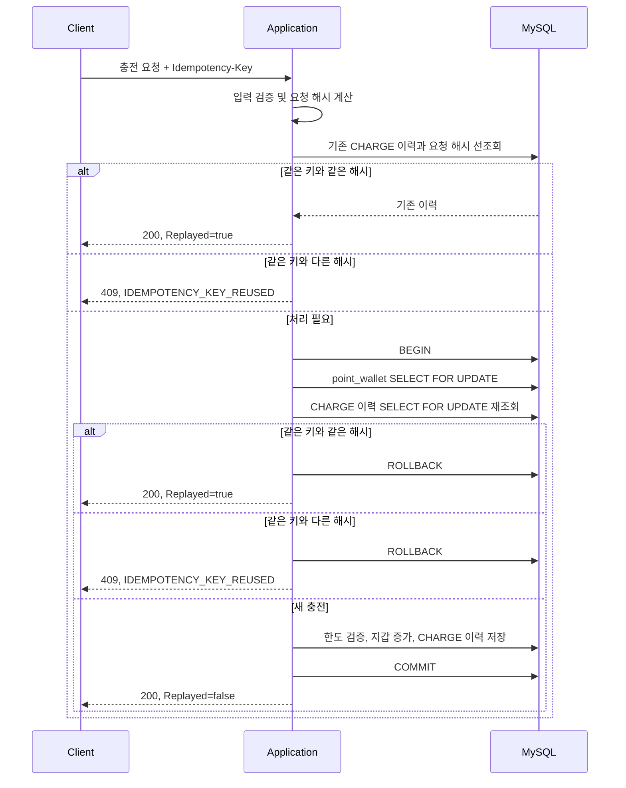
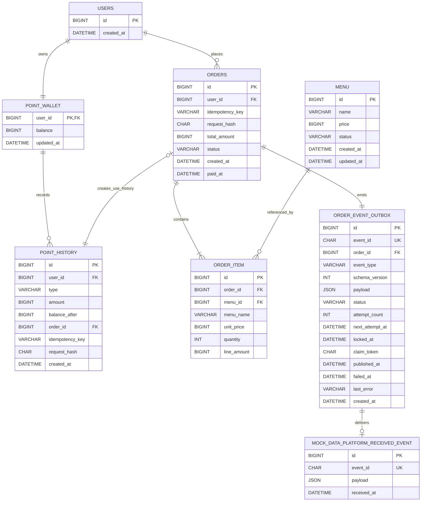
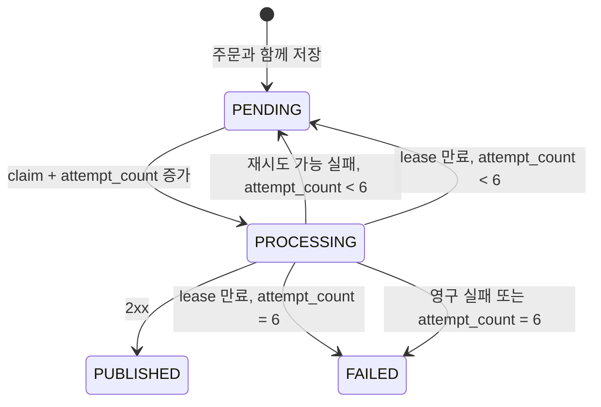

# Coffee Order System

다중 서버 환경에서 동시성, 데이터 일관성, 장애 복구를 고려하는 커피 주문 시스템 과제입니다.

요구사항 분석, ERD, API 명세, 동시성·트랜잭션·Outbox 상세 전략과 기술 스택 승인을 완료했고, Spring Boot 기본 구조와 MySQL 8.4.10 통합 테스트 기반, 메뉴 목록, 포인트 충전, 주문·결제, 트랜잭션 내 `PENDING` Outbox 저장, Outbox 게시자와 Mock 데이터 플랫폼, 최근 168시간 인기 메뉴 TOP 3 조회, 전역 오류·traceId 계약 보강까지 구현했습니다. 기능 간 MySQL 회귀·부하 기준선과 각 구현의 근거는 제출 기록과 [S11 기준선](docs/performance/S11_BASELINE.md)에 보존합니다.

## 설계 목표와 의도

이 시스템의 핵심 목표는 다중 서버 환경에서 같은 사용자의 요청이 동시에 처리되더라도 포인트가 중복 사용되거나 주문, 포인트 이력과 외부 전송 대상 데이터가 서로 어긋나지 않도록 하는 것입니다.

포인트와 주문처럼 즉시 일관성이 필요한 데이터는 하나의 DB 트랜잭션과 DB 락으로 보호합니다. 반면 외부 데이터 플랫폼은 네트워크 장애와 응답 지연이 내부 주문 성공에 영향을 주지 않도록 Transactional Outbox로 분리합니다. 이 경계 안에서 다음 원칙을 지킵니다.

- 금액 계산과 상태 변경의 최종 판단은 클라이언트가 아니라 서버와 DB가 담당합니다.
- 주문, 포인트 차감, 이력과 Outbox 이벤트는 함께 성공하거나 함께 실패합니다.
- 재요청과 중복 전송은 정상적으로 발생할 수 있다고 보고 멱등성과 소비자 중복 제거를 설계합니다.
- 동시성 제어는 특정 JVM에 의존하지 않고 모든 서버 인스턴스가 공유하는 DB를 기준으로 수행합니다.
- 데이터 저장 시각은 UTC로 통일하고 한국 사용자가 보는 API 시각은 `Asia/Seoul`로 표현합니다.
- 테스트에서 경계 시각, 동시 요청과 외부 장애를 재현할 수 있도록 설계합니다.

## 과제 범위

- 커피 메뉴 목록 조회
- 포인트 충전
- 여러 메뉴 주문 및 포인트 결제
- 주문 데이터를 외부 데이터 플랫폼으로 실시간 전송
- 현재 시각 기준 최근 168시간 인기 메뉴 TOP 3 조회
- 다중 서버 동시성, 데이터 일관성 및 테스트 고려

회원가입, 사용자 관리, 메뉴 관리, 주문 취소는 이번 과제 범위에 포함하지 않습니다. 사용자와 메뉴는 사전에 존재하며, 사용자를 생성할 때 잔액이 0P인 포인트 지갑도 함께 생성합니다.

## 기술 스택과 프로젝트 구조

### 런타임과 빌드 도구

2026-07-14 기준 공식 지원 범위와 과제 평가 환경의 재현성을 함께 고려하여 다음 조합을 사용합니다.

| 구분 | 선택 | 검토한 대안 | 선택 이유와 트레이드오프 |
| --- | --- | --- | --- |
| Java | Java 17 LTS | Java 21·25 LTS | 이번 과제에 Java 21 이상의 언어 기능이 필수는 아니며 현재 학습·평가 환경과의 호환 범위를 넓힙니다. 더 최신 LTS의 지원 기간 이점보다 실행 장벽을 낮추는 것을 우선하며, 필요하면 이후 toolchain 버전만 올릴 수 있습니다. |
| Spring Boot | `3.5.16` | `4.1.0` | [`3.5.16`은 Java 17~25와 Gradle 8.4 이상을 공식 지원](https://docs.spring.io/spring-boot/3.5/system-requirements.html)하는 stable 버전입니다. 최신 major인 4.1은 [Jakarta EE 11, Jackson 3와 starter 구조 변경](https://github.com/spring-projects/spring-boot/wiki/Spring-Boot-4.0-Migration-Guide)이 있어 이번 과제의 핵심인 트랜잭션·동시성 검증보다 마이그레이션 차이에 설명 비용이 커집니다. |
| 빌드 | Gradle Wrapper `8.14.5`, Groovy DSL | Maven Wrapper, Gradle Kotlin DSL | Spring Initializr가 Spring Boot 3.5.16 조합에 생성하는 [Wrapper](https://docs.gradle.org/current/userguide/gradle_wrapper.html) patch를 고정하여 개발자·CI·평가자가 같은 버전을 사용합니다. Groovy DSL은 이 규모에서 설정이 짧고 Spring 예제와 비교하기 쉽습니다. Maven의 명시적인 POM과 Kotlin DSL의 타입 안전성도 장점이지만 별도 이득보다 학습 비용이 큽니다. |
| 데이터베이스 | MySQL `8.4.10` LTS | MySQL 8.0, 9.x Innovation | [MySQL 8.4 LTS](https://dev.mysql.com/doc/refman/8.4/en/mysql-releases.html)는 기능 안정성과 장기 지원에 초점을 둡니다. 움직이는 `8.4`·`latest` 태그 대신 [8.4.10](https://dev.mysql.com/doc/relnotes/mysql/8.4/en/)을 Docker Compose와 Testcontainers에 같이 고정하여 재현성을 확보합니다. |
| 스키마 관리 | Flyway versioned migration | Hibernate DDL, `schema.sql` | `db/migration`을 스키마 변경의 단일 경로로 사용하고 Hibernate는 `ddl-auto=validate`로 매핑만 검증합니다. MySQL 지원을 위해 [`flyway-mysql` 모듈](https://documentation.red-gate.com/fd/mysql-277579322.html)을 명시합니다. |

Spring Boot가 BOM으로 관리하는 Spring Framework, Hibernate, MySQL Connector/J, Flyway, HikariCP와 Testcontainers 버전은 개별 재정의하지 않습니다. 보안 수정이나 실제 호환성 문제가 있을 때만 근거와 검증 결과를 남기고 override합니다. Flyway 공식 검증 버전 표의 갱신 시점과 MySQL 8.4 LTS 사이에 문서 공백이 있을 수 있으므로 빈 `mysql:8.4.10` 컨테이너에 migration을 적용하고 재시작 시 `validate`까지 성공하는 smoke test를 필수로 둡니다.

### 기본 의존성과 테스트 도구

| 목적 | 의존성 | 적용 시점 |
| --- | --- | --- |
| MVC API와 입력 검증 | `spring-boot-starter-web`, `spring-boot-starter-validation` | 기본 구조 |
| 영속성과 운영 확인 | `spring-boot-starter-data-jpa`, `spring-boot-starter-actuator` | 기본 구조 |
| DB와 migration | `mysql-connector-j`, `flyway-core`, `flyway-mysql` | 기본 구조 |
| 외부 데이터 플랫폼 HTTP | Apache HttpClient 5 classic | Outbox 게시자 |
| 단위·API 테스트 | `spring-boot-starter-test`, Spring Test의 `MockRestServiceServer` | 기본 구조와 기능별 테스트 |
| 실제 MySQL 통합 테스트 | `spring-boot-testcontainers`, Testcontainers JUnit·MySQL | 기본 구조 |
| 실제 소켓 장애 테스트 | WireMock | Outbox 게시자 |

Lombok은 엔티티 생성 규칙을 숨기고 IDE plugin 의존성을 늘리므로 사용하지 않고, DTO는 적합한 곳에서 Java `record`를 사용합니다. Redis, Kafka, Spring Retry, WebFlux와 H2도 초기 의존성에 넣지 않습니다. 재시도 상태는 Outbox DB가 관리하고, MySQL의 락·격리 수준·`SKIP LOCKED`를 검증해야 하므로 H2 테스트는 실제 동작을 대체할 수 없습니다.

Actuator는 health와 기본 Micrometer 지표를 얻기 위한 기반으로만 사용합니다. 공개 API 경로와 분리하고 초기에는 필요한 endpoint만 노출하며, Prometheus 같은 별도 registry는 부하 테스트에서 실제 필요가 확인될 때 추가합니다.

### 패키지와 계층 경계

기본 패키지는 `com.usersy628.coffeeorder`입니다. 최상위에 `controller`, `service`, `repository`를 수평으로 모으지 않고 기능을 먼저 나눈 뒤 기능 안에서 계층을 구분합니다.

```text
com.usersy628.coffeeorder
├── CoffeeOrderApplication
├── global
│   ├── config
│   ├── error
│   ├── time
│   └── trace
├── user
│   ├── domain
│   └── infrastructure
├── menu
│   ├── api
│   ├── application
│   ├── domain
│   └── infrastructure
├── point
│   ├── api
│   ├── application
│   ├── domain
│   └── infrastructure
├── order
│   ├── api
│   ├── application
│   ├── domain
│   └── infrastructure
├── popularity
│   ├── api
│   ├── application
│   └── infrastructure
├── outbox
    ├── application
    ├── domain
    └── infrastructure
        ├── http
        ├── persistence
        └── scheduling
└── mockplatform
    ├── api
    ├── application
    └── infrastructure
```

각 기능은 필요한 계층만 만들며 빈 package를 미리 생성하지 않습니다.

- `api`: Controller와 HTTP 요청·응답 DTO를 둡니다. 트랜잭션과 비즈니스 규칙을 넣지 않습니다.
- `application`: 유스케이스, 트랜잭션 경계와 외부 의존성 port를 둡니다. 락·멱등성·재시도 순서를 조정합니다.
- `domain`: 엔티티, 값, 상태와 도메인 불변식을 둡니다. 이번 단일 애플리케이션에서는 JPA annotation을 허용하되 Controller나 외부 HTTP 타입에는 의존하지 않습니다.
- `infrastructure`: Spring Data JPA adapter, native SQL, HTTP client와 scheduler 구현을 둡니다.
- `global`: 오류 계약, traceId, 시간과 공통 기술 설정처럼 실제 횡단 관심사만 둡니다. 도메인별 편의 함수를 `global`에 모으지 않습니다.

순수 헥사고날 구조를 기계적으로 적용하여 모든 클래스에 interface를 만들지는 않습니다. 외부 데이터 플랫폼, 시간, aggregate 저장처럼 교체하거나 격리 테스트할 실제 경계에만 port를 두어 구조적 설명 가능성과 과제 규모를 맞춥니다.

Spring proxy를 우회하는 self-invocation을 막기 위해 충전과 주문의 일시적 DB 충돌 재시도 coordinator와 실제 `@Transactional(timeout = 5)` 명령 executor는 서로 다른 Spring Bean으로 분리합니다. 충전은 유니크 충돌 후 기존 결과를 새 read-only transaction에서 읽고, 주문은 같은 사용자의 요청이 지갑 락에서 직렬화되므로 락을 얻은 transaction 안에서 기존 주문을 current read로 재확인합니다. 재시도 coordinator는 실패한 전체 명령을 transaction 밖에서 다시 호출하며, 예외가 발생한 transaction 안에서는 처리를 계속하지 않습니다.

### 설정, 초기 데이터와 테스트 구성

- `application.yml`에는 UTC, JPA `ddl-auto=validate`, Open Session In View 비활성화와 공통 설정을 둡니다.
- `application-local.yml`은 환경 변수로 로컬 MySQL에 연결하고, `compose.yaml`은 `mysql:8.4.10`을 실행합니다. 예측 가능한 개발용 기본 비밀번호가 외부에 노출되지 않도록 host port는 `127.0.0.1`에만 바인딩하며 저장소에는 운영 비밀번호를 두지 않습니다.
- `application-test.yml`에는 고정 JDBC URL을 넣지 않고 `MySQLContainer`와 `@ServiceConnection`이 JDBC와 Flyway 연결 정보를 제공합니다.
- HikariCP는 인스턴스당 최대 10개 연결, 연결 획득 대기 2초, 검증 대기 1초로 시작하고 `connectionInitSql`로 새 MySQL session의 `innodb_lock_wait_timeout`을 2초로 설정합니다.
- Hikari 연결 획득 대기 2초, MySQL 행 락 대기 2초와 명령 트랜잭션 timeout 5초는 서로 다른 제한입니다. 연결 획득은 트랜잭션 시작 전에 발생할 수 있으므로 명령 트랜잭션 5초에 항상 포함된다고 가정하지 않습니다.
- Flyway `V1`은 ERD의 schema를 만들고 `V2`는 과제 실행에 필요한 사용자·메뉴와 각 사용자의 0P 지갑을 함께 삽입합니다. `V2`는 과제용 고정 초기 데이터이며 실제 서비스에서는 환경별 기준 데이터를 schema migration과 분리합니다. 테스트별 가변 데이터는 migration에 넣지 않고 test fixture에서 생성합니다.
- 단위 테스트는 시간·해시·금액 같은 순수 규칙, MVC slice는 API 계약, MySQL Testcontainers 통합 테스트는 FK·CHECK·락·트랜잭션과 native query에 집중합니다. 핵심 통합 테스트는 Docker가 없다고 건너뛰지 않고 실행 환경 문제를 드러냅니다.

외부 데이터 플랫폼 adapter는 Apache HttpClient 5 classic을 사용하고 HTTP client 내부 자동 재시도를 끕니다. connection pool 대기, DNS·TLS·connect와 read를 포함한 시도당 5초 전체 예산은 구성값과 외부 watchdog으로 제한합니다. deadline이 지나면 `HttpPost.cancel()`로 실제 요청 취소를 시도하고, deadline worker는 대기열 없는 최대 동시성 수만큼만 두어 멈추지 않는 I/O가 새 이벤트를 무한히 쌓지 못하게 합니다. WireMock 실제 소켓 테스트에서 경과 시간과 호출 횟수를 검증합니다. 재시도 횟수와 백오프의 유일한 소유자는 계속 Outbox입니다.

## 실행 가이드

### 준비 조건

- Java 17과 저장소의 Gradle Wrapper를 사용합니다. 시스템 Gradle을 별도로 설치할 필요가 없습니다.
- 아래 Compose 경로와 전체 테스트에는 Docker Desktop 또는 Docker Engine이 실행 중이어야 합니다. 이미 호환되는 MySQL을 직접 실행 중이면 Docker 없이 `local` 앱을 기동할 수 있지만, 전체 테스트는 Testcontainers의 별도 MySQL 컨테이너를 사용하므로 Docker가 필요합니다.
- 성능 기준선은 이 가이드와 분리합니다. `local,perf` 프로필, `docker-compose.performance.yml`, `PERF_MYSQL_*` 환경 변수와 포트 3308/18081은 [S11 기준선 문서](docs/performance/S11_BASELINE.md)를 따릅니다.

### 일반 로컬 MySQL 시작

프로젝트 루트에서 개발용 환경 파일을 만들고 MySQL을 시작합니다. `.env`는 Git에서 무시되며 운영 비밀번호를 넣는 파일이 아닙니다.

```powershell
Copy-Item .env.example .env
docker compose --env-file .env -f compose.yaml config
docker compose --env-file .env -f compose.yaml up -d --wait
```

기본값은 `127.0.0.1:3306`, 데이터베이스 `coffee_order`, 사용자 `coffee`입니다. Compose를 다른 빈 포트로 열려면 `.env`의 `MYSQL_PORT`만 바꿉니다. 예를 들어 다른 개발용 컨테이너와 충돌하지 않게 3307을 사용할 수 있습니다.

```text
MYSQL_PORT=3307
```

Compose는 해당 포트를 loopback에만 열고 MySQL 8.4.10, UTC, healthcheck와 named volume을 사용합니다. 첫 애플리케이션 실행 때 Flyway가 스키마와 과제용 초기 데이터를 적용합니다. 초기 데이터는 사용자 1~3의 0P 지갑, 판매 중인 메뉴 1 아메리카노(4,500P)·2 카페라테(5,000P), 판매 중지 메뉴 3입니다.

중지하되 개발 DB를 보존하려면 `docker compose -f compose.yaml down`을 사용합니다. `down -v`는 named volume의 로컬 데이터를 지우므로 새 초기화가 필요할 때만 사용합니다.

### 이미 실행 중인 로컬 MySQL 사용

이미 3307처럼 별도 포트에서 MySQL을 실행 중이면 Compose를 다시 시작하지 않습니다. `MYSQL_DATABASE`가 존재하고 해당 사용자에게 schema·table 생성 권한이 있어야 Flyway가 V1~V3을 적용할 수 있습니다. 예를 들어 로컬 MySQL 관리자 계정으로 다음처럼 과제용 DB와 사용자만 만듭니다. 실제 로컬 비밀번호는 저장소에 적지 않고, 아래 placeholder를 자신의 개발용 값으로 바꿉니다.

```sql
CREATE DATABASE IF NOT EXISTS coffee_order
  CHARACTER SET utf8mb4 COLLATE utf8mb4_0900_ai_ci;
CREATE USER IF NOT EXISTS 'coffee'@'localhost' IDENTIFIED BY 'local-only-password';
GRANT ALL PRIVILEGES ON coffee_order.* TO 'coffee'@'localhost';
FLUSH PRIVILEGES;
```

그 뒤 앱 환경 변수의 `MYSQL_PORT`, `MYSQL_DATABASE`, `MYSQL_USER`, `MYSQL_PASSWORD`를 실제 서버 값과 맞춥니다. 예를 들어 기존 MySQL이 3307이면 아래 애플리케이션 실행 예시의 `MYSQL_PORT=3307`을 사용합니다.

### 애플리케이션 실행

`application-local.yml`은 프로세스 환경 변수로 로컬 MySQL에 연결합니다. Docker Compose의 `.env`는 Gradle이나 IntelliJ에 자동 전달되지 않으므로, 앱을 시작할 때 같은 `MYSQL_*` 값을 설정합니다.

기본 Compose 값을 쓰는 PowerShell 예시는 다음과 같습니다.

```powershell
$env:SPRING_PROFILES_ACTIVE = 'local'
$env:MYSQL_PORT = '3306'
$env:MYSQL_DATABASE = 'coffee_order'
$env:MYSQL_USER = 'coffee'
$env:MYSQL_PASSWORD = 'coffee-local'
$env:SERVER_PORT = '8080'
.\gradlew.bat bootRun
```

3307 MySQL과 18080 서버를 쓰려면 `.env`의 `MYSQL_PORT=3307`과 아래 앱 환경 변수를 같은 값으로 맞춥니다. `SERVER_PORT`는 Spring Boot 표준 환경 변수이므로 별도 설정 파일 변경 없이 적용됩니다.

```powershell
$env:SPRING_PROFILES_ACTIVE = 'local'
$env:MYSQL_PORT = '3307'
$env:MYSQL_DATABASE = 'coffee_order'
$env:MYSQL_USER = 'coffee'
$env:MYSQL_PASSWORD = 'coffee-local'
$env:SERVER_PORT = '18080'
.\gradlew.bat bootRun
```

IntelliJ IDEA에서는 Run/Debug Configuration의 Environment variables에 같은 값을 넣고 `SPRING_PROFILES_ACTIVE=local`을 설정합니다. Gradle JVM도 Java 17을 선택합니다. `local` 프로필은 과제용 Mock 데이터 플랫폼 게시자를 같은 서버의 loopback 주소로 켜므로, 실제 외부 플랫폼 URL을 추가할 필요가 없습니다.

앱이 시작되면 선택한 포트로 health와 초기 메뉴를 확인합니다.

```powershell
curl.exe --fail http://127.0.0.1:18080/actuator/health
curl.exe --fail http://127.0.0.1:18080/api/menus
```

18080 대신 기본 포트를 사용했다면 URL의 포트도 8080으로 바꿉니다. health 응답은 `{"status":"UP"}`이고, 메뉴 목록에는 판매 상태를 포함한 메뉴 1~3이 반환됩니다.

### API 빠른 확인

아래 예시는 18080을 쓴 경우입니다. 상태를 바꾸는 요청에는 매번 새 UUID를 사용하고, 네트워크 재시도일 때만 같은 `Idempotency-Key`와 같은 본문을 재사용합니다. PowerShell에서는 JSON을 native `curl.exe`의 인자가 아니라 표준입력으로 넘겨 따옴표가 손실되지 않게 합니다. `--data-binary '@-'`의 작은따옴표는 PowerShell이 `@`를 별도 문법으로 해석하지 않게 합니다.

```powershell
$baseUrl = 'http://127.0.0.1:18080'

curl.exe --fail "$baseUrl/api/menus"

$chargeKey = [guid]::NewGuid().ToString()
$chargeBody = '{"amount":10000}'
$chargeBody | curl.exe -i --fail-with-body -X POST "$baseUrl/api/users/1/points/charges" `
  -H 'Content-Type: application/json' `
  -H "Idempotency-Key: $chargeKey" `
  --data-binary '@-'

$orderKey = [guid]::NewGuid().ToString()
$orderBody = '{"items":[{"menuId":1,"quantity":1},{"menuId":2,"quantity":1}]}'
$orderBody | curl.exe -i --fail-with-body -X POST "$baseUrl/api/users/1/orders" `
  -H 'Content-Type: application/json' `
  -H "Idempotency-Key: $orderKey" `
  --data-binary '@-'

curl.exe --fail "$baseUrl/api/menus/popular"
```

충전 성공은 `200 OK`와 `chargedAmount`, `balance`, `chargedAt`을, 최초 주문 성공은 `201 Created`와 정렬된 `items`, `totalAmount`, `balanceAfter`, `paidAt`을 반환합니다. 같은 키·같은 본문을 다시 보내면 결제나 충전은 한 번만 반영되고 `Idempotency-Replayed: true` 응답으로 기존 결과를 돌려줍니다. 자세한 요청·응답 필드와 오류 코드는 아래 [API 명세](#api-명세)와 [주요 오류 정책](#주요-오류-정책)을 기준으로 합니다.

### 테스트와 패키징

전체 테스트는 `application-test.yml`과 Testcontainers를 사용해 별도 MySQL 컨테이너를 시작합니다. 따라서 위 일반 로컬 DB나 포트를 사용하지 않지만 Docker가 실행 중이어야 합니다.

```powershell
.\gradlew.bat test --no-daemon --rerun-tasks
.\gradlew.bat bootJar --no-daemon
```

테스트 실패가 Docker 연결 문제를 말하면 먼저 Docker Engine이 실행 중인지 확인합니다. 성능용 대규모 fixture와 k6는 일반 `test`에 포함하지 않으므로, 필요할 때만 [S11 기준선 문서](docs/performance/S11_BASELINE.md)의 `performanceTest` 절차를 따릅니다.

## 핵심 정책

### 포인트

- 1원은 1P이며 모든 금액은 정수로 관리합니다.
- 한 번에 1P 이상 300,000P 이하를 충전할 수 있습니다.
- 충전 후 총잔액은 300,000P를 초과할 수 없고, 잔액은 음수가 될 수 없습니다.
- 잔액 변경과 포인트 이력 저장은 하나의 트랜잭션으로 처리합니다.
- 다중 서버 동시성은 `SELECT ... FOR UPDATE`를 이용한 DB 비관적 락으로 제어합니다.
- 충전 API도 `Idempotency-Key`를 필수로 받아 응답 유실 후 재요청으로 같은 금액이 중복 충전되는 것을 방지합니다.
- 충전 멱등 키와 `amount`의 SHA-256 요청 해시는 `point_history`의 `CHARGE` 이력에 저장합니다.
- 포인트 충전과 결제는 서버 DB 안에서 처리하며 외부 결제사나 PG API를 호출하지 않습니다. 이번 과제의 유일한 외부 HTTP 연동은 주문 커밋 후 Outbox 게시자가 호출하는 데이터 수집 플랫폼입니다.

### 주문

- 한 주문에 여러 메뉴와 메뉴별 수량을 입력할 수 있습니다.
- 수량은 1 이상이며, 한 요청에 같은 메뉴 ID가 중복되면 `400 Bad Request`로 실패합니다.
- `items`의 null 항목, `menuId`·`quantity` 누락, 0·음수와 Java `int` 범위를 넘는 수량은 모두 `400 INVALID_ORDER_REQUEST`로 처리합니다. 별도의 최대 수량이나 최대 항목 수 제한은 추가하지 않습니다.
- 메뉴가 없거나 판매 중지된 항목이 하나라도 있으면 전체 주문을 실패시킵니다.
- 결제 금액은 클라이언트 입력이 아닌 DB의 메뉴 가격으로 계산합니다.
- 결제 후 잔액이 0P가 되는 것은 허용합니다.
- 주문, 주문 항목, 포인트 차감, 포인트 사용 이력, Outbox 이벤트가 하나의 DB 트랜잭션으로 커밋되어야 주문이 성공합니다.
- 주문 항목에는 주문 당시 메뉴명, 단가, 수량 및 항목 금액을 스냅샷으로 저장합니다.
- 입력 순서와 관계없이 주문 항목 저장, 최초 응답, 멱등 replay 응답과 Outbox payload의 `items`를 `menuId` 오름차순으로 통일합니다. 입력 순서를 보존하는 `position` 컬럼은 추가하지 않습니다.

### 주문 멱등성

- 주문 API의 `Idempotency-Key` 헤더는 필수입니다.
- 별도의 멱등성 테이블을 두지 않고 `orders`에 멱등 키와 요청 해시를 저장합니다.
- `(user_id, idempotency_key)` 유니크 제약을 최종 방어선으로 사용합니다.
- 메뉴 ID로 정렬한 `menuId`와 `quantity` 목록을 canonical payload로 만들고 SHA-256 해시를 저장합니다.
- 같은 키와 같은 요청이면 새 결제 없이 기존 주문 결과를 반환합니다.
- 같은 키와 다른 요청이면 `409 Conflict`와 `IDEMPOTENCY_KEY_REUSED` 오류를 반환합니다.
- 같은 사용자의 주문과 충전은 모두 지갑 행을 먼저 잠근 뒤 멱등 결과를 다시 확인하여 사용자별로 직렬화합니다.
- 같은 사용자의 주문은 지갑 락을 먼저 얻은 뒤 기존 주문을 `FOR UPDATE` current read로 재확인하므로 동시 요청도 선행 커밋 결과를 봅니다. `(user_id, idempotency_key)` 유니크 제약은 애플리케이션 순서가 바뀌거나 예상하지 못한 경합이 생길 때의 최종 방어선입니다.
- 멱등 키의 범위는 `사용자 + API 작업 종류`입니다. 충전과 주문은 서로 다른 테이블에 저장하므로 문자열이 우연히 같아도 서로 충돌하지 않지만, 클라이언트는 모든 변경 요청에 새 UUID를 사용합니다.
- 주문과 충전의 멱등 키는 각 도메인 테이블에 영구 보관합니다. 실패 결과나 처리 중 상태, 키 만료까지 저장해야 한다면 별도 멱등성 테이블로 확장합니다.

### 외부 데이터 플랫폼

- Transactional Outbox 패턴을 사용합니다.
- 주문 트랜잭션에서는 데이터 수집 플랫폼을 호출하지 않고 Outbox 이벤트까지만 저장합니다.
- 별도 게시자가 커밋된 이벤트를 과제용 Mock 데이터 플랫폼으로 HTTP 전송합니다. 실제 외부 서비스 계정이나 결제 API는 필요하지 않습니다.
- 전송 성공 전까지 같은 이벤트가 중복 전달될 수 있는 at-least-once 시도 모델을 사용하며, 소비자는 `eventId`로 중복 이벤트를 제거해야 합니다.
- 최대 시도 후 `FAILED`가 된 이벤트는 자동 최종 전달을 보장하지 않으며 과제에서는 상태와 마지막 오류를 남겨 확인할 수 있게 합니다. 운영자 redrive와 보관·정리 배치는 실무 확장 범위로 둡니다.
- 2xx는 이벤트 전송 성공으로 처리하지만 주문 성공 조건에는 영향을 주지 않습니다.
- 네트워크 오류, timeout과 5xx는 지수 백오프와 jitter로 최초 실패 후 최대 5회 재시도합니다. 최초 전송을 포함한 최대 시도 횟수는 6회입니다.
- 과제용 Mock 계약에서는 4xx를 요청 데이터 오류로 보고 즉시 `FAILED`로 전환합니다. 실제 플랫폼 계약이 생기면 408·429 같은 재시도 가능 응답을 별도로 분류합니다.
- 과제용 Mock 데이터 플랫폼은 같은 Spring Boot 애플리케이션 안의 내부 HTTP 수신기이며 `local`, `test` 프로필에서만 활성화합니다. 공개 클라이언트 API가 아니므로 `/api` 경로 아래에 두지 않습니다.
- 게시자는 설정된 base URL의 `POST /internal/mock-data-platform/events`로 Outbox의 변경되지 않은 JSON payload와 `Idempotency-Key: eventId`를 전송합니다.
- Mock 수신기는 V3의 `mock_data_platform_received_event`에 `event_id` 유니크, 수신 payload와 `received_at`을 하나의 트랜잭션으로 저장합니다. 같은 `eventId`는 기존 수집 결과를 유지한 채 `200 OK`를 반환합니다.
- 기본 프로필에서는 게시 스케줄러를 비활성화합니다. `local`은 현재 서버 포트를 가리키는 loopback base URL로 활성화하고, 그 밖의 환경에서 게시자를 켜려면 실제 데이터 플랫폼 base URL을 명시해야 합니다. URL 없이 활성화하면 시작 시 실패시켜 의도하지 않은 self-call을 막습니다.

### 인기 메뉴

- 조회 시각 `T`를 한 번만 고정합니다.
- `[T - 168시간, T)` 범위의 `PAID` 주문만 집계합니다.
- `SUM(order_item.quantity)`로 메뉴별 판매 수량을 계산합니다.
- 판매 수량 내림차순, 동률이면 메뉴 ID 오름차순으로 정렬하여 최대 3개를 반환합니다.
- 데이터가 없으면 빈 목록을 반환합니다.
- 현재 시각은 직접 호출하지 않고 테스트에서 교체할 수 있는 `Clock`을 주입합니다.

## API 명세

### 공통 규칙

- 기본 경로는 `/api`이며 현재 과제에서는 URL 버전을 포함하지 않습니다. 경로가 단순한 대신 향후 호환되지 않는 변경이 생기면 새 경로나 헤더 기반 버전 전략을 별도로 도입해야 합니다.
- 사용자 인증은 과제 범위 밖이므로 사용자 식별자는 경로의 `{userId}`로 전달합니다.
- 실제 운영 서비스에서는 경로 값만 신뢰하지 않고 인증 principal의 사용자 ID와 대조하여 다른 사용자의 자원에 접근하지 못하게 해야 합니다.
- `{userId}`는 1 이상의 정수여야 하며 형식이 잘못되면 `400 Bad Request`와 `INVALID_USER_ID`를 반환합니다.
- 요청과 응답은 `application/json`이며 JSON 필드명은 `camelCase`를 사용합니다.
- JSON 문법을 해석할 수 없으면 `400 MALFORMED_JSON`, JSON 변경 API에 지원하지 않는 `Content-Type`을 보내면 `415 UNSUPPORTED_MEDIA_TYPE`을 반환합니다.
- ID, 수량과 금액은 JSON 정수로 표현합니다. 금액 단위는 원이자 포인트입니다. 공개 웹 API로 확장되어 `BIGINT` ID가 JavaScript 안전 정수 범위를 넘을 수 있다면 ID 문자열 반환을 검토합니다.
- 성공 응답은 공통 래퍼 없이 각 API의 결과를 직접 반환합니다.
- API 시간은 ISO 8601 형식과 한국시간 오프셋을 포함하여 `2026-07-14T15:30:00+09:00`처럼 반환합니다.
- 서버 내부와 DB에는 동일한 시각을 UTC로 저장하고 API 경계에서 `Asia/Seoul`로 변환합니다.
- `Idempotency-Replayed`는 이 API에서 정의한 사용자 지정 응답 헤더입니다. 최초 반영은 `false`, 기존 결과 재현은 `true`이며 이를 모르는 클라이언트도 응답 본문을 정상적으로 처리할 수 있어야 합니다.

공통 오류 응답은 다음 형식을 사용합니다. 클라이언트 분기는 번역될 수 있는 `message`가 아니라 `code`를 사용합니다. `details`는 필드 오류처럼 추가 정보가 있을 때 사용하고, 없으면 빈 객체를 반환하며 `traceId`는 서버 로그와 요청을 연결하는 식별자입니다.

```json
{
  "code": "INVALID_CHARGE_AMOUNT",
  "message": "충전 금액은 1P 이상 300,000P 이하여야 합니다.",
  "details": {
    "field": "amount",
    "rejectedValue": 0
  },
  "traceId": "0af7651916cd43dd8448eb211c80319c"
}
```

현재 과제에서는 도메인 오류 코드가 간단히 드러나는 자체 형식을 사용합니다. 외부 공개 API 간 표준 상호운용성이 중요해지면 [RFC 9457](https://www.rfc-editor.org/rfc/rfc9457.html)의 `application/problem+json` 형식으로 확장할 수 있습니다. 오류 응답과 로그에는 토큰, 비밀번호와 내부 스택 트레이스 같은 민감정보를 포함하지 않습니다.

### API 목록

| 기능 | Method | URI |
| --- | --- | --- |
| 메뉴 목록 조회 | `GET` | `/api/menus` |
| 포인트 충전 | `POST` | `/api/users/{userId}/points/charges` |
| 여러 메뉴 주문 및 포인트 결제 | `POST` | `/api/users/{userId}/orders` |
| 최근 168시간 인기 메뉴 TOP 3 | `GET` | `/api/menus/popular` |

Outbox 게시와 외부 데이터 플랫폼 수신은 클라이언트 공개 API가 아니라 내부 비동기 처리 및 테스트용 Mock 영역으로 구분합니다.

### 메뉴 목록 조회

판매 중지 메뉴를 포함한 전체 메뉴를 ID 오름차순으로 반환합니다. 과제에서 메뉴 수가 제한적이고 페이지네이션 요구가 없으므로 현재는 페이지네이션을 적용하지 않습니다.

```http
GET /api/menus
```

성공 응답: `200 OK`

```json
[
  {
    "menuId": 1,
    "name": "아메리카노",
    "price": 4500,
    "status": "ON_SALE"
  },
  {
    "menuId": 2,
    "name": "카페라테",
    "price": 5000,
    "status": "ON_SALE"
  },
  {
    "menuId": 3,
    "name": "디카페인 아메리카노",
    "price": 5000,
    "status": "STOPPED"
  }
]
```

메뉴가 없으면 `200 OK`와 빈 배열을 반환합니다.

### 포인트 충전

`userId`는 1 이상의 정수이고 `amount`는 1P 이상 300,000P 이하의 정수여야 합니다. 충전 후 잔액이 300,000P를 초과하면 전체 요청을 실패시킵니다. `Idempotency-Key`는 공백이 아닌 1자 이상 255자 이하의 필수 헤더입니다.

```http
POST /api/users/1/points/charges
Content-Type: application/json
Idempotency-Key: f64e1530-e93b-40ce-a6e6-886d89d5fbbc
```

```json
{
  "amount": 10000
}
```

최초 성공 응답: `200 OK`, `Idempotency-Replayed: false`

```json
{
  "userId": 1,
  "chargedAmount": 10000,
  "balance": 25000,
  "chargedAt": "2026-07-14T15:30:00+09:00"
}
```

`amount`만 포함한 canonical payload의 SHA-256을 저장합니다. 같은 키와 같은 금액을 다시 보내면 새 충전 없이 `200 OK`, `Idempotency-Replayed: true`와 최초 `point_history.balance_after`, `created_at`으로 복원한 응답을 반환합니다. 같은 키와 다른 금액이면 `409 Conflict`로 실패합니다.

| 조건 | HTTP 상태 | 오류 코드 |
| --- | --- | --- |
| 사용자 ID 형식 오류 | `400` | `INVALID_USER_ID` |
| 멱등 키 누락 | `400` | `IDEMPOTENCY_KEY_REQUIRED` |
| 멱등 키 길이 또는 형식 오류 | `400` | `INVALID_IDEMPOTENCY_KEY` |
| 충전 금액 형식·범위 오류 | `400` | `INVALID_CHARGE_AMOUNT` |
| 사용자 없음 | `404` | `USER_NOT_FOUND` |
| 충전 후 총잔액 한도 초과 | `409` | `POINT_LIMIT_EXCEEDED` |
| 같은 멱등 키와 다른 금액 | `409` | `IDEMPOTENCY_KEY_REUSED` |
| DB 락·데드락 재시도 소진 | `503` | `CONCURRENT_REQUEST_TIMEOUT` |

### 여러 메뉴 주문 및 포인트 결제

`Idempotency-Key`는 공백이 아닌 1자 이상 255자 이하의 필수 헤더이며 사용자별로 유일합니다. 요청에는 메뉴 ID와 수량만 포함하고 가격은 서버가 DB에서 조회하여 계산합니다.

```http
POST /api/users/1/orders
Content-Type: application/json
Idempotency-Key: 3f83e46e-29ae-4bab-93da-c06c4396e012
```

```json
{
  "items": [
    {
      "menuId": 1,
      "quantity": 2
    },
    {
      "menuId": 2,
      "quantity": 1
    }
  ]
}
```

최초 성공 응답: `201 Created`, `Idempotency-Replayed: false`

```json
{
  "orderId": 101,
  "userId": 1,
  "status": "PAID",
  "totalAmount": 14000,
  "balanceAfter": 11000,
  "items": [
    {
      "menuId": 1,
      "menuName": "아메리카노",
      "unitPrice": 4500,
      "quantity": 2,
      "lineAmount": 9000
    },
    {
      "menuId": 2,
      "menuName": "카페라테",
      "unitPrice": 5000,
      "quantity": 1,
      "lineAmount": 5000
    }
  ],
  "paidAt": "2026-07-14T15:35:00+09:00"
}
```

같은 키와 같은 정규화 요청을 다시 보내면 새 주문이나 포인트 차감 없이 `200 OK`, `Idempotency-Replayed: true`와 기존 주문 응답을 반환합니다. 재현 응답의 `balanceAfter`는 현재 지갑이 아니라 해당 주문의 `USE point_history.balance_after`, `paidAt`은 `orders.paid_at`, 항목은 `order_item` 스냅샷에서 복원합니다. 동시에 도착한 같은 요청도 선행 트랜잭션이 완료된 뒤 같은 규칙을 적용합니다. 별도의 `PROCESSING` 응답은 사용하지 않습니다.

| 조건 | HTTP 상태 | 오류 코드 |
| --- | --- | --- |
| 사용자 ID 형식 오류 | `400` | `INVALID_USER_ID` |
| 멱등 키 누락 | `400` | `IDEMPOTENCY_KEY_REQUIRED` |
| 멱등 키 길이 또는 형식 오류 | `400` | `INVALID_IDEMPOTENCY_KEY` |
| 빈 주문, 중복 메뉴 ID, 수량 오류 | `400` | `INVALID_ORDER_REQUEST` |
| 사용자 없음 | `404` | `USER_NOT_FOUND` |
| 메뉴 없음 | `404` | `MENU_NOT_FOUND` |
| 판매 중지 메뉴 포함 | `409` | `MENU_NOT_ON_SALE` |
| 포인트 부족 | `409` | `INSUFFICIENT_POINTS` |
| 같은 멱등 키와 다른 요청 | `409` | `IDEMPOTENCY_KEY_REUSED` |
| DB 락·데드락 재시도 소진 | `503` | `CONCURRENT_REQUEST_TIMEOUT` |

### 최근 168시간 인기 메뉴 TOP 3 조회

```http
GET /api/menus/popular
```

성공 응답: `200 OK`

```json
{
  "from": "2026-07-07T15:40:00+09:00",
  "to": "2026-07-14T15:40:00+09:00",
  "items": [
    {
      "rank": 1,
      "menuId": 1,
      "menuName": "아메리카노",
      "totalQuantity": 42
    },
    {
      "rank": 2,
      "menuId": 2,
      "menuName": "카페라테",
      "totalQuantity": 31
    }
  ]
}
```

조회 시각 `T`를 한 번 얻어 `[T - 168시간, T)`를 집계하고 `from`과 `to`에도 같은 경계를 사용합니다. 메뉴명은 현재 메뉴명을 반환하며, 메뉴별 판매 수량 내림차순과 메뉴 ID 오름차순으로 순위를 결정합니다. 집계 결과가 없으면 `items`를 빈 배열로 반환합니다.

초기 구현은 다음 직접 집계 쿼리를 사용합니다.

```sql
SELECT oi.menu_id,
       m.name AS menu_name,
       SUM(oi.quantity) AS total_quantity
FROM orders o
JOIN order_item oi ON oi.order_id = o.id
JOIN menu m ON m.id = oi.menu_id
WHERE o.paid_at >= :from_utc
  AND o.paid_at < :to_utc
GROUP BY oi.menu_id, m.name
ORDER BY total_quantity DESC, oi.menu_id ASC
LIMIT 3;
```

현재 `orders`는 `CHECK (status = 'PAID')`이므로 쿼리에서 상태 조건을 생략합니다. 주문 상태가 확장되면 `WHERE status = 'PAID'`와 `(status, paid_at, id)` 인덱스를 함께 추가합니다.

MySQL은 정수 컬럼의 `SUM()`도 `DECIMAL`로 반환할 수 있으므로 native query 결과는 `BigDecimal` 또는 `Number`로 받은 뒤 범위를 확인하여 `longValueExact()`로 변환합니다. 데이터와 호출량이 커져 직접 집계가 병목으로 확인될 때만 짧은 TTL 캐시, 집계 테이블 또는 스트리밍 사전 집계를 도입합니다.

## 동시성 및 트랜잭션 상세 전략

포인트 잔액을 변경하는 충전과 주문은 모두 같은 `point_wallet` 행을 직렬화 지점으로 사용합니다. 애플리케이션의 사전 조회는 빠른 재응답을 위한 최적화일 뿐이며, 지갑 락 획득 후 멱등 결과를 반드시 다시 확인합니다.

### 포인트 충전 흐름



### 주문 및 결제 흐름

1. 트랜잭션 밖에서 형식 검증, 중복 메뉴 확인, canonical payload와 요청 해시를 계산합니다.
2. 트랜잭션에서 `point_wallet`을 `SELECT ... FOR UPDATE`로 먼저 잠급니다.
3. 지갑 락을 획득한 뒤 `(user_id, idempotency_key)`를 `SELECT ... FOR UPDATE` current read로 조회합니다. MySQL `REPEATABLE READ`의 이전 스냅샷이 아니라 락 대기 중 커밋된 최신 행을 확인합니다. 선행 주문이 커밋되었다면 현재 트랜잭션을 종료하고 요청 해시에 따라 재현 또는 `409`를 반환합니다.
4. 새 주문이면 메뉴 존재 여부와 판매 상태를 확인하고 DB 가격으로 총액을 계산합니다. 각 항목은 곱셈 전에 남은 잔액과 나눗셈으로 비교하여 `BIGINT` 금액 오버플로 없이 포인트 부족을 판정합니다. 현재 과제에서는 메뉴 관리가 없어 메뉴 행 락을 추가하지 않습니다.
5. 주문, 주문 항목, 지갑 차감, `USE` 이력과 Outbox 이벤트를 저장하고 한 번에 커밋합니다.

같은 사용자의 모든 주문은 지갑 락에서 직렬화되므로 정상 처리 순서에서는 `(user_id, idempotency_key)` 유니크 충돌이 발생하지 않습니다. 유니크 제약은 이후 락·저장 순서가 바뀌거나 예상하지 못한 경합이 생길 때의 최종 방어선이며, 충돌 예외가 발생한 트랜잭션 안에서 처리를 계속하지 않습니다.

향후 메뉴 수정 기능이 추가되면 가격 및 판매 상태 변경과 주문 사이의 정책을 정하고 메뉴 행 락 또는 버전 기반 재검증을 도입합니다.

S8은 주문 트랜잭션 안에서 `PENDING` Outbox 한 건을 저장하는 데까지만 담당합니다. claim, lease, fencing, 외부 전송, retry, `PUBLISHED`·`FAILED` 전이와 Mock consumer는 S9에서 구현합니다.

### 락 순서, 타임아웃과 재시도

- 모든 잔액 변경 경로는 `point_wallet`을 먼저 잠근 뒤 주문 또는 충전 멱등 데이터를 생성합니다. 같은 자원을 서로 다른 순서로 잠그지 않습니다.
- 트랜잭션 안에서는 DB 작업만 수행하고 외부 HTTP 호출, 대기와 긴 계산을 하지 않습니다.
- 지갑 락 대기 2초는 각 트랜잭션 시도에 적용하는 초기 fail-fast 값입니다. 정상 명령은 짧게 끝나야 하므로 같은 지갑의 장기 대기로 요청 스레드와 DB 커넥션이 쌓이는 것을 막고, 부하 테스트의 락 대기 분포를 보고 조정합니다.
- 명령 트랜잭션 timeout 5초는 락 대기 최대 2초와 주문·이력·Outbox 저장 시간을 포함하는 각 DB 트랜잭션 시도의 상한입니다. 외부 HTTP 호출과 전체 API 응답 시간을 뜻하지 않습니다.
- 데드락 또는 락 획득 타임아웃은 요청 내용이 잘못된 비즈니스 실패가 아니라 실행 순서가 바뀌면 성공할 수 있는 일시적인 인프라 충돌로 분류합니다.
- 재시도는 실패한 SQL 한 문장이 아니라 트랜잭션 경계 밖에서 전체 명령을 새 트랜잭션으로 수행합니다.
- 최초 시도 후 최대 2회 재시도하며 50ms, 100ms 기준 지수 백오프와 ±20% jitter를 적용합니다. 이 값은 설정으로 분리합니다.
- 재시도 소진 시 `503 Service Unavailable`, `CONCURRENT_REQUEST_TIMEOUT`을 반환하고 클라이언트는 같은 멱등 키로 안전하게 다시 요청할 수 있습니다.
- 구현 테스트에서는 동일 사용자 100개 동시 요청, 서로 다른 사용자 병렬 요청, 강제 데드락과 락 타임아웃을 검증합니다.

## 예외 처리와 추적

예외는 서비스 계층에서 HTTP 응답으로 직접 바꾸지 않습니다. 트랜잭션 안에서 발생한 예외는 밖으로 전파하여 먼저 롤백하고, `@RestControllerAdvice`가 한 곳에서 공통 오류 응답으로 변환합니다. 컨트롤러마다 `try/catch`를 반복하지 않습니다.

| 분류 | 처리 위치와 정책 |
| --- | --- |
| JSON 문법·타입 오류 | `HttpMessageNotReadableException`을 `400 MALFORMED_JSON`으로 변환합니다. 예를 들어 문자열 형태의 `amount`는 범위 오류가 아니라 JSON 타입 오류입니다. |
| 존재하지 않는 API 경로 | `NoHandlerFoundException`과 `NoResourceFoundException`을 `404 ENDPOINT_NOT_FOUND`로 변환하여 catch-all이 서버 오류로 오분류하지 않게 합니다. |
| 요청 값 검증 | Bean Validation과 교차 필드 검증 결과를 충전은 `INVALID_CHARGE_AMOUNT`, 주문은 `INVALID_ORDER_REQUEST`로 변환합니다. 여러 오류는 `details.fieldErrors` 배열에 `field`, `reason`, 선택적인 `rejectedValue`로 반환합니다. |
| 도메인 오류 | 작은 `ErrorCode`와 단일 `DomainException` 조합으로 기존 404·409 정책을 표현하며 오류 코드마다 예외 클래스를 만들지 않습니다. |
| 멱등 유니크 충돌 | 모든 `DataIntegrityViolationException`을 409로 바꾸지 않습니다. 이름을 지정한 멱등 유니크 제약만 명령 계층에서 식별하여 전체 롤백 후 새 읽기 전용 트랜잭션으로 재현 또는 `IDEMPOTENCY_KEY_REUSED`를 판단합니다. 그 밖의 FK·CHECK 위반은 구현 결함으로 취급합니다. |
| 락·데드락 | Advice에서 즉시 변환하지 않고 트랜잭션 밖 재시도 계층이 전체 명령을 새 트랜잭션으로 재시도합니다. 소진된 전용 예외만 `503 CONCURRENT_REQUEST_TIMEOUT`으로 변환합니다. |
| Outbox 전송 오류 | 주문 요청의 Advice 대상이 아닙니다. 게시자가 `PENDING`, `PROCESSING`, `PUBLISHED`, `FAILED` 상태 전이와 `last_error`로 처리합니다. |
| 예상하지 못한 오류 | `500 INTERNAL_SERVER_ERROR`, 일반화된 메시지, 빈 `details`와 `traceId`만 반환하고 내부 예외 메시지와 스택 트레이스는 노출하지 않습니다. |

요청 시작 시 `OncePerRequestFilter`가 서버가 신뢰하는 UUID `traceId`를 만들고 MDC와 `X-Trace-Id` 응답 헤더에 같은 값을 넣습니다. 외부에서 전달된 값을 그대로 신뢰하지 않으며 요청 종료 시 MDC를 제거합니다. 예상된 4xx는 스택 없이 기록하고, 재시도 소진 503은 시도 횟수와 함께 경고로, 예상하지 못한 500은 서버 로그에만 스택과 함께 기록합니다. 원문 `Idempotency-Key`, 전체 요청·이벤트 payload, 인증정보와 외부 응답 전문은 로그에 남기지 않습니다. 비동기 전송은 요청 trace 대신 `eventId`와 `orderId`를 상관관계 식별자로 사용합니다.

## ERD



## 테이블 설계

금액은 Java `long`, MySQL `BIGINT`를 사용합니다. 현재 한도는 `int` 범위 안이지만 주문 합계와 향후 정책 확장에서 발생할 수 있는 오버플로를 줄이고 도메인 전체의 금액 타입을 통일하기 위한 선택입니다.

### `users`

| 컬럼 | 타입 | 제약 | 설명 |
| --- | --- | --- | --- |
| `id` | `BIGINT` | PK | 사용자 식별자 |
| `created_at` | `DATETIME(6)` | NOT NULL | 생성 시각 |

사용자 생성 트랜잭션에서 잔액 0P의 `point_wallet`도 함께 생성합니다. FK만으로 모든 사용자에게 지갑이 반드시 존재한다는 역방향 조건을 강제할 수 없으므로 애플리케이션 생성 흐름과 초기 데이터 검증으로 이 불변식을 보장합니다.

### `point_wallet`

| 컬럼 | 타입 | 제약 | 설명 |
| --- | --- | --- | --- |
| `user_id` | `BIGINT` | PK, FK | 사용자 및 지갑 식별자 |
| `balance` | `BIGINT` | NOT NULL, DEFAULT 0 | 현재 잔액 |
| `updated_at` | `DATETIME(6)` | NOT NULL | 마지막 변경 시각 |

- `CHECK (balance BETWEEN 0 AND 300000)`
- `FOREIGN KEY (user_id) REFERENCES users(id) ON DELETE RESTRICT`
- 비관적 락을 사용하므로 현재 설계에는 낙관적 락용 `version` 컬럼을 두지 않습니다.

### `point_history`

| 컬럼 | 타입 | 제약 | 설명 |
| --- | --- | --- | --- |
| `id` | `BIGINT` | PK | 이력 식별자 |
| `user_id` | `BIGINT` | FK, NOT NULL | 지갑 소유 사용자 |
| `type` | `VARCHAR(20)` | NOT NULL | `CHARGE`, `USE` |
| `amount` | `BIGINT` | NOT NULL | 충전은 양수, 사용은 음수 |
| `balance_after` | `BIGINT` | NOT NULL | 변경 직후 잔액 |
| `order_id` | `BIGINT` | FK, NULL 허용, UNIQUE | 사용 이력의 주문 |
| `idempotency_key` | `VARCHAR(255)` | NULL 허용 | 충전 멱등 키 |
| `request_hash` | `CHAR(64)` | NULL 허용 | 충전 canonical payload의 SHA-256 |
| `created_at` | `DATETIME(6)` | NOT NULL | 잔액 변경 시각 |

- `CHARGE`이면 `amount > 0`, `order_id IS NULL`, `idempotency_key IS NOT NULL`, `request_hash IS NOT NULL`이어야 합니다.
- `USE`이면 `amount < 0`, `order_id IS NOT NULL`, `idempotency_key IS NULL`, `request_hash IS NULL`이어야 합니다.
- 위 `type`, `amount`, `order_id`, `idempotency_key`, `request_hash` 조합은 설명에만 의존하지 않고 두 유효 조합 중 하나만 허용하는 단일 DB `CHECK`로 강제합니다.

```sql
CHECK (
    (type = 'CHARGE' AND amount > 0 AND order_id IS NULL
        AND idempotency_key IS NOT NULL AND request_hash IS NOT NULL)
 OR (type = 'USE' AND amount < 0 AND order_id IS NOT NULL
        AND idempotency_key IS NULL AND request_hash IS NULL)
)
```

- `CHECK (balance_after BETWEEN 0 AND 300000)`을 적용합니다.
- `UNIQUE (order_id)`로 한 주문에 포인트 사용 이력이 중복 생성되는 것을 방지합니다. MySQL 유니크 인덱스는 여러 `NULL`을 허용하므로 충전 이력에는 영향을 주지 않습니다.
- `UNIQUE (user_id, idempotency_key)`로 충전 재요청의 중복 반영을 방지합니다. `USE` 이력의 `NULL`에는 영향을 주지 않습니다.
- `idempotency_key`는 대소문자를 구분하는 `utf8mb4_bin` 계열 collation을 적용합니다.
- `FOREIGN KEY (user_id) REFERENCES point_wallet(user_id) ON DELETE RESTRICT`
- `FOREIGN KEY (order_id) REFERENCES orders(id) ON DELETE RESTRICT`

### `menu`

| 컬럼 | 타입 | 제약 | 설명 |
| --- | --- | --- | --- |
| `id` | `BIGINT` | PK | 메뉴 식별자 |
| `name` | `VARCHAR(100)` | NOT NULL | 현재 메뉴명 |
| `price` | `BIGINT` | NOT NULL | 현재 판매 가격 |
| `status` | `VARCHAR(20)` | NOT NULL | `ON_SALE`, `STOPPED` |
| `created_at` | `DATETIME(6)` | NOT NULL | 생성 시각 |
| `updated_at` | `DATETIME(6)` | NOT NULL | 수정 시각 |

- `CHECK (price >= 1)`
- `CHECK (status IN ('ON_SALE', 'STOPPED'))`

### `orders`

| 컬럼 | 타입 | 제약 | 설명 |
| --- | --- | --- | --- |
| `id` | `BIGINT` | PK | 주문 식별자 |
| `user_id` | `BIGINT` | FK, NOT NULL | 주문 사용자 |
| `idempotency_key` | `VARCHAR(255)` | NOT NULL | 주문 멱등 키 |
| `request_hash` | `CHAR(64)` | NOT NULL | canonical request의 SHA-256 |
| `total_amount` | `BIGINT` | NOT NULL | 서버가 계산한 주문 총액 |
| `status` | `VARCHAR(20)` | NOT NULL | 현재 범위에서는 `PAID` |
| `created_at` | `DATETIME(6)` | NOT NULL | 주문 생성 시각 |
| `paid_at` | `DATETIME(6)` | NOT NULL | 결제 완료 시각 |

- `UNIQUE (user_id, idempotency_key)`
- `CHECK (total_amount >= 1)`
- `CHECK (status = 'PAID')`
- `FOREIGN KEY (user_id) REFERENCES users(id) ON DELETE RESTRICT`
- `idempotency_key`에는 대소문자를 구분하는 `utf8mb4_bin` 계열 collation을 적용합니다.
- 현재 주문 트랜잭션은 완료 상태만 커밋하므로 `PENDING`을 저장하지 않습니다. 취소 기능이 추가되면 상태 모델을 확장합니다.

### `order_item`

| 컬럼 | 타입 | 제약 | 설명 |
| --- | --- | --- | --- |
| `id` | `BIGINT` | PK | 주문 항목 식별자 |
| `order_id` | `BIGINT` | FK, NOT NULL | 주문 식별자 |
| `menu_id` | `BIGINT` | FK, NOT NULL | 원본 메뉴 식별자 |
| `menu_name` | `VARCHAR(100)` | NOT NULL | 주문 당시 메뉴명 |
| `unit_price` | `BIGINT` | NOT NULL | 주문 당시 단가 |
| `quantity` | `INT` | NOT NULL | 주문 수량 |
| `line_amount` | `BIGINT` | NOT NULL | 단가와 수량을 곱한 금액 |

- `UNIQUE (order_id, menu_id)`
- `CHECK (unit_price >= 1)`
- `CHECK (quantity >= 1)`
- `CHECK (line_amount = unit_price * quantity)`
- `FOREIGN KEY (order_id) REFERENCES orders(id) ON DELETE RESTRICT`
- `FOREIGN KEY (menu_id) REFERENCES menu(id) ON DELETE RESTRICT`

### `order_event_outbox`

| 컬럼 | 타입 | 제약 | 설명 |
| --- | --- | --- | --- |
| `id` | `BIGINT` | PK | 내부 식별자 |
| `event_id` | `CHAR(36)` | UNIQUE, NOT NULL | 소비자 중복 제거용 UUID |
| `order_id` | `BIGINT` | FK, NOT NULL | 주문 식별자 |
| `event_type` | `VARCHAR(50)` | NOT NULL | `ORDER_COMPLETED` |
| `schema_version` | `INT` | NOT NULL, DEFAULT 1 | 외부 이벤트 스키마 버전 |
| `payload` | `JSON` | NOT NULL | 재시도마다 동일하게 보내는 이벤트 전문 |
| `status` | `VARCHAR(20)` | NOT NULL | `PENDING`, `PROCESSING`, `PUBLISHED`, `FAILED` |
| `attempt_count` | `INT` | NOT NULL, DEFAULT 0 | 선점되어 전송 단계에 진입한 횟수 |
| `next_attempt_at` | `DATETIME(6)` | NULL 허용 | `PENDING`의 다음 재시도 가능 시각 |
| `locked_at` | `DATETIME(6)` | NULL 허용 | 선점 시각 |
| `claim_token` | `CHAR(36)` | NULL 허용 | 선점마다 새로 발급하는 fencing UUID |
| `published_at` | `DATETIME(6)` | NULL 허용 | 전송 완료 시각 |
| `failed_at` | `DATETIME(6)` | NULL 허용 | 최종 실패 전환 시각 |
| `last_error` | `VARCHAR(1000)` | NULL 허용 | 민감정보와 외부 응답 전문을 제거한 마지막 실패 요약 |
| `created_at` | `DATETIME(6)` | NOT NULL | 이벤트 생성 시각 |

- `UNIQUE (event_id)`
- `UNIQUE (order_id, event_type)`
- `CHECK (status IN ('PENDING', 'PROCESSING', 'PUBLISHED', 'FAILED'))`
- `CHECK (attempt_count BETWEEN 0 AND 6)`
- `CHECK (schema_version >= 1)`
- 새 이벤트는 `PENDING`, `attempt_count = 0`, `next_attempt_at = UTC_TIMESTAMP(6)`으로 생성합니다. 모든 `PENDING`은 `attempt_count < 6`, `next_attempt_at IS NOT NULL`이어야 하며 claim 정보가 없어야 합니다.
- `PROCESSING`이면 `locked_at`, `claim_token`이 모두 존재해야 합니다.
- `PUBLISHED`이면 `published_at`, `FAILED`이면 `failed_at`과 `last_error`가 존재해야 하며 두 terminal 상태에는 `next_attempt_at`과 claim 정보가 없어야 합니다. 6번째 lease 만료도 `LEASE_EXPIRED_MAX_ATTEMPTS` 같은 내부 사유를 기록합니다.
- `FOREIGN KEY (order_id) REFERENCES orders(id) ON DELETE RESTRICT`

`UNIQUE (order_id, event_type)`은 현재 주문마다 `ORDER_COMPLETED` 이벤트가 하나뿐이라는 정책에 맞습니다. 향후 같은 주문에서 동일 타입의 이벤트를 여러 번 발행해야 한다면 aggregate version을 추가하고 이 제약을 확장합니다.

### `mock_data_platform_received_event`

| 컬럼 | 타입 | 제약 | 설명 |
| --- | --- | --- | --- |
| `id` | `BIGINT` | PK | Mock 수집 기록 식별자 |
| `event_id` | `CHAR(36)` | UNIQUE, NOT NULL | 소비자 중복 제거 식별자 |
| `payload` | `JSON` | NOT NULL | 최초 수신한 이벤트 전문 |
| `received_at` | `DATETIME(6)` | NOT NULL | Mock 플랫폼 수신 시각 |

- 이 테이블은 과제용 Mock의 중복 제거 기록과 수집 데이터 반영을 함께 보존합니다. 별도 FK를 두지 않아 Mock 소비자가 Outbox 내부 식별자나 주문 테이블에 결합하지 않습니다.
- `event_id`가 이미 있으면 기존 row를 변경하지 않습니다. 따라서 게시자가 수신 직후 종료되어 재전송해도 수집 데이터가 한 번만 반영됩니다.

이벤트 payload는 생성 후 변경하지 않으며 모든 재시도에서 같은 `eventId`와 내용을 전송합니다.

```json
{
  "eventId": "779f66da-29dd-4d70-88d6-51b4bc4a04f1",
  "eventType": "ORDER_COMPLETED",
  "schemaVersion": 1,
  "occurredAt": "2026-07-14T06:35:00Z",
  "orderId": 101,
  "data": {
    "userId": 1,
    "totalAmount": 14000,
    "items": [
      {
        "menuId": 1,
        "menuName": "아메리카노",
        "unitPrice": 4500,
        "quantity": 2,
        "lineAmount": 9000
      },
      {
        "menuId": 2,
        "menuName": "카페라테",
        "unitPrice": 5000,
        "quantity": 1,
        "lineAmount": 5000
      }
    ]
  }
}
```

게시자는 짧은 DB 트랜잭션에서 다음 조건의 이벤트를 `FOR UPDATE SKIP LOCKED`로 조회하여 다중 인스턴스 간 중복 선점을 방지합니다.

```sql
SELECT id
FROM order_event_outbox
WHERE status = 'PENDING'
  AND attempt_count < 6
  AND next_attempt_at <= UTC_TIMESTAMP(6)
ORDER BY next_attempt_at, id
LIMIT :claim_limit
FOR UPDATE SKIP LOCKED;
```

`:claim_limit`은 설정된 배치 크기와 현재 즉시 실행 가능한 worker 슬롯 수 중 작은 값입니다. 선점 트랜잭션에서 `PROCESSING`으로 변경하고 `attempt_count`를 1 증가시키며 `next_attempt_at`을 비우고 `locked_at`과 매번 새로운 `claim_token`을 기록합니다. 이 시점의 attempt는 네트워크 호출 완료가 아니라 전송 단계에 진입한 횟수이며, 프로세스가 호출 직전에 종료되어도 보수적으로 retry budget을 소비합니다. 트랜잭션을 커밋한 후에만 데이터 수집 플랫폼을 호출합니다.

외부 플랫폼이 이벤트를 수신한 직후 게시자가 종료되면 같은 이벤트가 다시 전송될 수 있습니다. 따라서 게시자는 매번 같은 `event_id`를 사용하고, 외부 API가 멱등 헤더를 지원하면 같은 값을 `Idempotency-Key`로 전달합니다. Mock API 테스트에서도 소비자의 중복 제거를 검증합니다.

### Mock 데이터 플랫폼 수신 경계

- 내부 수신 URI는 `POST /internal/mock-data-platform/events`이고, 본문은 Outbox에 저장된 `ORDER_COMPLETED` JSON payload 그대로입니다. 수신기는 `eventId`를 중복 제거 키로 사용하며 요청 헤더의 `Idempotency-Key`는 게시자가 같은 값을 보냈는지 HTTP adapter 테스트로 검증합니다.
- Controller는 `local`과 `test` 프로필에서만 등록합니다. `local`에서는 현재 실행 서버의 loopback URL을 base URL로 사용하므로 별도 Mock 프로세스·컨테이너·포트가 필요하지 않습니다. 이 선택은 실제 HTTP 요청과 수신 DB 트랜잭션은 유지하면서 과제의 기동 복잡도를 낮춥니다.
- `test` 프로필에서는 scheduler를 끄고 테스트가 `publishDueEvents()`를 직접 호출합니다. Mock receiver의 영속 중복 제거는 MySQL 통합 테스트로, timeout·5xx·연결 장애와 adapter의 숨은 재시도 없음은 WireMock 실제 소켓 테스트로 분리합니다.
- default 등 non-local/test 환경에서 scheduler를 활성화하려면 `coffee-order.outbox.publisher.data-platform-base-url`을 비어 있지 않게 설정해야 합니다. 이 조건은 애플리케이션 시작 시 검증합니다.

### Outbox 상태 전이와 fencing



lease timeout은 기본 30초이며 전체 HTTP call deadline 5초보다 충분히 길게 둡니다. 만료된 `PROCESSING` 이벤트는 `status = 'PROCESSING' AND locked_at < :lease_expired_at` 조건으로 원자적으로 회수합니다. `attempt_count < 6`이면 `PENDING`과 현재 UTC의 `next_attempt_at`으로 바꾸고, 6이면 `FAILED`와 `failed_at`을 기록합니다. 두 경우 모두 기존 claim 정보를 지웁니다. 회수된 이벤트를 다른 게시자가 선점하면 반드시 새로운 `claim_token`을 발급합니다.

늦게 끝난 이전 게시자가 새 게시자의 결과를 덮어쓰지 못하도록 모든 완료·실패 갱신은 자신이 소유한 claim에만 허용합니다.

```sql
UPDATE order_event_outbox
SET status = 'PUBLISHED',
    published_at = UTC_TIMESTAMP(6),
    next_attempt_at = NULL,
    last_error = NULL,
    failed_at = NULL,
    claim_token = NULL,
    locked_at = NULL
WHERE id = :id
  AND status = 'PROCESSING'
  AND claim_token = :claim_token;
```

영향받은 행이 0개면 lease가 만료되어 소유권을 잃은 것이므로 이전 게시자는 상태를 더 변경하지 않습니다. `PROCESSING`에서 재시도용 `PENDING` 또는 `FAILED`로 변경할 때도 동일한 `id`, `status`, `claim_token` 조건을 사용합니다. 재시도 전환은 다음 `next_attempt_at`을 기록하고 `failed_at`과 claim 정보를 지우며, 최종 실패 전환은 `next_attempt_at`을 지우고 `failed_at`과 마지막 오류를 기록한 뒤 claim 정보를 지웁니다.

### 외부 응답 분류와 재시도

| 결과 | 처리 |
| --- | --- |
| `2xx` | `PUBLISHED` |
| 네트워크 오류 또는 timeout | 재시도 |
| `5xx` | 재시도 |
| `4xx` | 과제용 Mock 계약에서는 데이터 오류로 보고 `FAILED` |

- 최초 시도는 즉시 수행하고 실패 후 1초, 2초, 4초, 8초, 16초 기준 지수 백오프에 ±20% jitter를 적용합니다. 최초 실패 후 최대 5회 재시도하며 6번째 시도까지 실패하면 `FAILED`, `failed_at`, `last_error`를 기록합니다.
- HTTP 클라이언트 내부 자동 재시도는 비활성화합니다. 재시도 소유자를 Outbox 하나로 제한하여 숨은 중복 호출을 막고 시도 예산을 한 곳에서 관리합니다. 단, `attempt_count`는 전송 단계 진입 횟수이므로 claim 후 HTTP 호출 전에 프로세스가 종료되면 실제 호출 수보다 클 수 있습니다.
- 한 번의 전체 HTTP call deadline은 기본 5초입니다. DNS, connection pool 대기, TLS, connect와 read를 모두 포함하여 느린 외부 플랫폼이 worker를 장시간 점유하지 않게 하고, 30초 lease 안에서 호출과 상태 갱신을 마칠 여유를 둡니다. 이 시간은 주문 API timeout이 아닙니다.
- 게시 주기 1초는 DB polling 부하와 실시간 전송의 발견 지연 사이의 초기 절충값입니다. 배치 10은 한 번에 잠그는 행 수를 작게 유지하기 위한 시작값이고, 인스턴스별 동시성 10은 선점한 이벤트를 내부 대기열에 쌓지 않고 즉시 보낼 수 있도록 배치와 맞춘 값입니다.
- 위 수치는 측정된 정답이 아니라 외부 설정으로 바꿀 초기값입니다. 전체 외부 호출 동시성은 `인스턴스 수 × 인스턴스별 동시성`이므로 수집 플랫폼의 전체 rate limit을 넘지 않는 범위에서 부하 테스트로 조정합니다.

### 과제 구현 범위와 관측

- Mock 소비자는 `eventId` 유니크 기록과 수집 데이터 반영을 한 트랜잭션으로 처리합니다. 같은 이벤트를 다시 받으면 데이터를 중복 반영하지 않고 기존 처리 결과와 `200 OK`를 반환하여 게시자가 `PUBLISHED`로 확정할 수 있게 합니다.
- `last_error`에는 길이를 제한한 오류 종류와 요약만 저장하고 인증정보, 외부 응답 전문과 전체 payload는 저장하지 않습니다.
- `PENDING`의 가장 오래된 대기 시간, 상태별 건수, 전송 성공·실패 수와 lease 회수 횟수만 우선 관찰합니다.
- 운영자 redrive, 보관 기간별 정리 배치, 감사 사유와 전용 관리 API는 과제 구현에서 제외합니다. 실제 운영 요구가 생기면 그때 컬럼과 정리용 인덱스를 함께 추가합니다.

초기 운영 파라미터는 다음과 같으며 모두 외부 설정으로 분리합니다.

| 항목 | 초기값 |
| --- | --- |
| 게시 주기 | 1초 |
| 배치 크기 | 10 |
| 인스턴스별 외부 호출 동시성 | 10 |
| 전체 HTTP call deadline | 5초 |
| lease timeout | 30초 |
| 최초 실패 후 최대 재시도 | 5회 |
| 백오프 기준 | 1초, 2초, 4초, 8초, 16초 + ±20% jitter |

## 인덱스

| 테이블 | 인덱스 | 목적 |
| --- | --- | --- |
| `orders` | `UNIQUE (user_id, idempotency_key)` | 사용자별 멱등성 보장 |
| `orders` | `INDEX (paid_at)` | 현재 모든 주문이 `PAID`인 범위에서 최근 168시간 탐색 |
| `order_item` | `UNIQUE (order_id, menu_id)` | 주문 내 메뉴 중복 방지 |
| `order_item` | `INDEX (menu_id)` | `menu_id` FK 지원. InnoDB 자동 생성에 맡기지 않고 migration에서 이름을 고정 |
| `point_history` | `UNIQUE (order_id)` | 주문별 중복 차감 방지 |
| `point_history` | `UNIQUE (user_id, idempotency_key)` | 사용자별 충전 멱등성 보장 |
| `order_event_outbox` | `UNIQUE (event_id)` | 이벤트 식별자 중복 방지 |
| `order_event_outbox` | `UNIQUE (order_id, event_type)` | 주문 이벤트 중복 생성 방지 |
| `order_event_outbox` | `INDEX (status, next_attempt_at)` | 전송 대상 배치 조회 |
| `order_event_outbox` | `INDEX (status, locked_at)` | 만료된 `PROCESSING` 이벤트 회수 |
| `mock_data_platform_received_event` | `UNIQUE (event_id)` | Mock 소비자 중복 제거와 최초 수집 payload 보존 |

InnoDB 보조 인덱스 리프에는 PK가 암묵적으로 포함되므로 마지막 `id`를 반복해서 선언하지 않습니다. Outbox 선점도 `ORDER BY next_attempt_at, id`로 인덱스 순서와 맞춥니다. 현재 `orders.status`는 항상 `PAID`이므로 선택도가 없는 `status`를 선두에 두지 않으며, 취소 등 다른 상태가 추가되면 `(status, paid_at)`을 다시 검토합니다.

`order_item`의 유니크 인덱스는 `order_id` 조인을 함께 지원합니다. `(order_id, menu_id, quantity)` covering index와 과제 범위에 없는 포인트 이력 조회용 인덱스, Outbox 보관·정리용 인덱스는 미리 만들지 않습니다. 실제 조회 API나 정리 배치를 구현하고 실행계획에서 필요성이 확인될 때 추가합니다.

MySQL Testcontainers에 소량 데이터뿐 아니라 최근 168시간 주문이 충분히 포함된 테스트 데이터를 넣고 `EXPLAIN ANALYZE`로 범위 탐색 행 수, 조인 순서와 실제 실행 시간을 확인합니다. 사용되지 않거나 쓰기 비용만 늘리는 인덱스는 제거합니다.

## 부하 대응과 확장 기준

현재 기준 구성은 stateless 애플리케이션 여러 대와 하나의 MySQL primary입니다. Redis, Kafka와 MySQL read replica는 구현하지 않습니다. 강의에서 학습한 Kafka·Redis ZSET 방식은 매우 빈번한 근실시간 랭킹에는 유용하지만, 이번 과제의 인기 메뉴는 요청 시각 `T`마다 달라지는 정확한 `[T - 168시간, T)` rolling window입니다. 먼저 원본 주문을 SQL로 집계하고, 부하 테스트로 병목이 확인되기 전에는 인프라를 추가하지 않습니다.

### 정합성에 따른 데이터 경로

| 데이터·작업 | 현재 경로 | 확장 허용 조건 |
| --- | --- | --- |
| 포인트 충전·차감·잔액 검증 | MySQL primary 필수 | replica·Redis 사용 금지 |
| 주문 가격·판매 상태·멱등성 확인 | MySQL primary 필수 | replica·Redis 사용 금지 |
| 주문·이력·Outbox 저장과 Outbox 선점 | MySQL primary 필수 | replica·Redis 사용 금지 |
| 메뉴 목록 | MySQL primary | 짧은 stale을 허용하는 정책이 생길 때 read replica 또는 캐시 검토 |
| 인기 메뉴 TOP 3 | MySQL primary 직접 집계 | 최대 stale 시간과 캐시 기준 시각을 제품 정책으로 승인한 뒤 replica·캐시 검토 |

read replica는 읽기 처리량을 분산할 뿐 락 경합이나 쓰기 병목을 해결하지 못하며 비동기 복제 지연이 있습니다. 포인트·주문·멱등성·Outbox처럼 read-after-write와 current read가 필요한 쿼리는 계속 primary로 보냅니다. 메뉴 목록이나 인기 메뉴도 현재는 즉시 일치 정책이므로 primary를 사용하고, 나중에 허용 가능한 stale 범위를 먼저 정한 뒤에만 분리합니다.

### Redis를 도입하게 될 때의 장애 정책

DB 부하와 Redis 메모리 과부하는 서로 다른 장애입니다. 현재 구성에는 Redis가 없으므로 DB 부하를 Redis로 우회한다는 정책도 없으며, 아래 내용은 Redis 도입 조건을 충족한 이후에만 적용합니다.

- Redis는 재생성 가능한 cache-aside 조회 캐시로만 사용하고 MySQL을 유일한 원본으로 유지합니다. 포인트 잔액, 주문, 멱등 결과, Outbox 상태와 중복 제거 기록은 Redis에 저장하지 않습니다.
- Redis timeout·장애·데이터 유실 시에는 짧은 timeout과 circuit breaker를 거쳐, 별도 동시성 bulkhead와 rate limit이 허용하는 범위에서만 MySQL로 우회합니다. 캐시 장애 트래픽으로 포인트·주문용 primary를 압박할 위험이 있으면 인기 메뉴 조회를 먼저 `503`으로 차단합니다. 캐시 용도에서는 Redis가 비영속이어도 정합성이 깨지지 않아야 하며, cold cache 집중은 TTL jitter와 요청 병합으로 완화합니다.
- rolling window 캐시는 새 주문이 없어도 과거 주문이 범위 밖으로 빠져 결과가 바뀌므로 주문 시 무효화만으로 충분하지 않습니다. 시간 버킷이나 TTL을 쓰려면 `from`, `to`와 새 `generatedAt`도 캐시 생성 기준 시각에 맞추고 최대 stale 시간을 새 제품 정책으로 승인받아야 합니다. 초기 cache miss는 primary에서 조회하며, 향후 read replica까지 사용하면 `replication lag + cache age`가 승인된 stale 한도를 넘지 않아야 합니다.
- Redis primary-replica 구성에 Sentinel을 결합하면 자동 failover를 제공하지만 비동기 복제의 최근 데이터 유실 가능성과 메모리 부족은 해결하지 않습니다. 제한된 DB fallback으로 SLO와 primary 보호 기준을 지키지 못한다는 장애 테스트 결과가 있을 때 독립 장애 영역의 Sentinel 3개 또는 관리형 Multi-AZ를 검토합니다. Redis Cluster는 키 공간과 메모리를 여러 shard로 분산할 수 있는 규모에서만 별도로 검토하며 하나의 hot key를 자동으로 분산하지는 못합니다.
- Redis를 사용한다면 `maxmemory`를 명시하고 `used_memory/maxmemory`, fragmentation, eviction·OOM 거부, p95 응답 지연과 replica lag를 함께 관찰합니다. 70%는 10분 이상 지속될 때의 조기 경보 기준일 뿐 Sentinel이나 Cluster 도입 기준이 아닙니다.

### 스케일 아웃 판단 신호

다음 값은 보편적인 정답이 아니라 S11 부하 테스트를 시작하기 위한 관찰 기준입니다. 먼저 목표 트래픽과 API p95 SLO를 정하고 k6로 재현한 뒤, 한 번에 하나의 병목만 개선하고 같은 시나리오를 다시 측정합니다.

| 신호 | 초기 판단 기준 | 우선 조치 |
| --- | --- | --- |
| 애플리케이션 포화 | p95 SLO 위반과 함께 인스턴스 CPU 70% 이상 또는 요청 실행기 사용률 80% 이상이 10분 지속, DB에는 여유가 있음 | 애플리케이션 인스턴스 수평 확장 |
| DB 읽기 병목 | primary CPU 70% 이상이 15분 지속하거나 커넥션 풀 사용률 80% 이상이 5분 지속하고 읽기 쿼리가 주원인 | `EXPLAIN ANALYZE`와 쿼리·인덱스 개선 후, stale 허용 조회만 read replica 검토 |
| DB 락 병목 | 락 대기 p95, 데드락 또는 `CONCURRENT_REQUEST_TIMEOUT` 비율 상승 | 애플리케이션 증설보다 트랜잭션 단축, hot key와 락 순서 점검. 무분별한 증설은 경합을 악화할 수 있음 |
| 인기 메뉴 집계 병목 | 쿼리·인덱스 개선 후에도 SLO를 위반하고 해당 쿼리가 DB 시간의 20% 이상이며, 승인된 TTL·시간 버킷으로 요청 로그를 재생했을 때 반복 조회 이점이 확인됨 | Redis cache-aside와 집계 테이블을 시험 비교하고, warm-up 후 hit rate 80%는 도입 후 유지 기준으로 사용 |
| Outbox 적체 | 가장 오래된 `PENDING`이 5초를 넘는 상태가 5분 지속하거나 backlog가 계속 증가 | 외부 rate limit과 DB 여유를 확인한 뒤 worker 동시성 또는 게시자 인스턴스 조정 |
| Redis 메모리 압박 | Redis 도입 후 `used_memory/maxmemory` 70% 이상이 10분 지속하면서 eviction·OOM 거부·p95 지연 중 하나가 함께 증가 | TTL·값 크기·fragmentation과 메모리 증설을 먼저 점검하고, shard 가능한 키 공간의 단일 노드 한계일 때만 Cluster 검토 |

RPS 자체만으로 스케일 아웃하지 않습니다. DB가 병목인데 애플리케이션만 늘리면 커넥션 수와 락 경쟁이 커질 수 있고, 외부 플랫폼이 병목인데 게시자만 늘리면 rate limit을 초과할 수 있으므로 지연·오류율·자원 포화·queue age를 함께 봅니다.

### 기준선 측정 환경 기록

부하·실행계획 결과는 숫자만으로 비교하지 않습니다. 각 기준선에는 commit과 측정 시각, OS·CPU 모델·논리 코어·RAM, 애플리케이션 인스턴스 수·profile·Java/JVM 옵션, MySQL·Docker 버전과 배치, 부하 발생기 버전·배치, 실제 검증한 데이터셋 크기, 시나리오, 지연·오류율·실효 RPS, Hikari pool·DB 락·Outbox queue age 관찰값을 함께 기록합니다. 비밀값은 기록하지 않습니다.

서로 다른 하드웨어·컨테이너 자원 제한·데이터 크기·동시 실행 프로세스에서 얻은 절대 실행 시간은 직접 우열을 판단하지 않습니다. 같은 환경과 같은 시나리오를 다시 측정해 변화 전후를 비교하고, 인덱스·Redis·read replica는 그 근거가 있을 때만 검토합니다.

S11의 격리된 local 기준선 실행 순서와 결과 양식은 [`docs/performance/S11_BASELINE.md`](docs/performance/S11_BASELINE.md)에 보존합니다.

## 시간 저장 기준

- 애플리케이션에서는 `Instant`를 사용합니다.
- DB에는 UTC 기준 `DATETIME(6)`으로 저장합니다.
- JDBC와 Hibernate의 시간대도 UTC로 고정합니다.
- 영속화하거나 조회 경계로 사용하는 `Instant`는 `DATETIME(6)`과 맞도록 마이크로초 단위로 절삭합니다. API는 최대 6자리 소수 초를 표현하며 소수 부분이 0인 예시는 초까지만 표시할 수 있습니다.
- 주문 명령은 주입된 `Clock`에서 `Instant`를 한 번만 얻어 마이크로초로 절삭하고 주문 `createdAt`·`paidAt`, 지갑 갱신, `USE` 이력, Outbox `occurredAt`·`createdAt`에 같은 값을 재사용합니다. `next_attempt_at`만 DB `UTC_TIMESTAMP(6)`를 사용합니다.
- 인기 메뉴 조회는 주입된 `Clock`에서 `T`를 한 번 얻고 마이크로초로 절삭한 뒤 `T - 168시간`과 `T`를 UTC 값으로 쿼리에 전달합니다. 응답의 `from`, `to`도 반드시 같은 두 값을 변환하여 사용합니다.
- `Asia/Seoul`은 API 표현과 정책 설명의 기준으로 사용하되 DB 서버나 세션의 암묵적인 시간대 변환에는 의존하지 않습니다.
- UTC 저장은 서버 위치와 세션 설정이 달라져도 주문, 로그와 Outbox 시각을 동일한 순간으로 비교하기 위한 선택입니다. 사용자에게 UTC를 노출하는 것이 아니라 API 경계에서 `Asia/Seoul`로 변환하여 `+09:00` 오프셋과 함께 반환합니다.
- 외부 이벤트의 `occurredAt`은 UTC `Z` 형식으로 전송합니다. Outbox 선점, lease와 재시도 시각은 서버 인스턴스 시계 차이의 영향을 줄이기 위해 DB `UTC_TIMESTAMP(6)`를 기준으로 계산합니다.
- 향후 한국 날짜 단위 집계가 필요하면 `Asia/Seoul`에서 시작과 종료 경계를 계산한 뒤 UTC로 변환하여 조회합니다.

## 문제 해결 전략 및 기술적 선택 이유

| 문제 | 선택한 전략 | 검토한 대안 | 선택 이유 | 트레이드오프 및 보완 |
| --- | --- | --- | --- | --- |
| 다중 서버 포인트 동시성 | DB 비관적 락 `SELECT ... FOR UPDATE` | JVM `synchronized`, 낙관적 락 | 모든 서버가 공유하는 지갑 행을 잠가 검증과 갱신을 직렬화하고 잔액 음수를 방지합니다. | 동일 사용자 요청은 대기하므로 트랜잭션을 DB 작업만으로 짧게 유지하고 2초 락 대기로 fail-fast 합니다. |
| 충전 멱등성 | `point_history`에 키와 요청 해시 저장, 지갑 락 후 재확인 | 비관적 락만 사용, 별도 멱등성 테이블 | 응답 유실 후 순차 재요청까지 중복 충전 없이 최초 결과로 복원합니다. | 실패 결과와 처리 중 상태는 저장하지 않으며 필요해지면 별도 테이블로 확장합니다. |
| 주문 원자성 | 주문, 항목, 포인트 차감, 이력, Outbox를 한 DB 트랜잭션으로 저장 | 단계별 별도 저장과 보상 처리 | 중간 실패 시 일부 데이터만 남는 상태를 DB 롤백으로 방지합니다. | 트랜잭션 범위가 넓어질 수 있어 네트워크 호출은 포함하지 않습니다. |
| 주문 멱등성 | `orders`에 키와 요청 해시 저장, DB 유니크 제약 | 별도 멱등성 테이블, 애플리케이션 선조회만 사용 | 주문과 멱등 결과가 같은 트랜잭션 생명주기를 가져 구조가 단순하며 유니크 제약이 동시 요청의 최종 방어선이 됩니다. | 처리 중 상태와 실패 응답을 별도로 저장하기 어렵습니다. 현재는 선행 트랜잭션 완료까지 대기하고 커밋 결과만 재사용합니다. |
| 요청 동일성 판단 | 메뉴 ID 정렬 후 canonical payload의 SHA-256 저장 | 원본 JSON 문자열 비교 | JSON 필드나 메뉴 순서가 달라도 의미가 같은 요청을 동일하게 판단합니다. | canonical 규칙이 바뀌면 호환성 문제가 생기므로 규칙을 테스트로 고정합니다. |
| 외부 데이터 전송 | Transactional Outbox | 주문 트랜잭션 안에서 직접 호출, 커밋 후 메모리 작업 큐 | 주문과 이벤트 저장의 원자성을 지키면서 외부 장애를 주문 성공과 분리합니다. | 게시자, 재시도와 정체 이벤트 모니터링이 추가로 필요합니다. |
| 이벤트 전달 보장 | 중복 가능한 at-least-once 시도 모델과 `eventId` 중복 제거 | exactly-once 전달 | 네트워크 단절 시 전송 성공 여부를 완전히 알 수 없으므로 같은 이벤트 재전송을 허용하는 방식이 현실적입니다. | 소비자 멱등 처리가 필수이며 최대 시도 후 `FAILED` 확인까지만 과제에 포함하고 redrive는 실무 확장으로 둡니다. |
| Outbox 다중 인스턴스 선점 | `FOR UPDATE SKIP LOCKED`, 짧은 선점 트랜잭션, `claim_token` fencing | 분산 락, 인스턴스별 고정 파티션 | 별도 인프라 없이 여러 게시자가 잠긴 행을 건너뛰며 병렬 처리하고 늦게 끝난 작업자의 상태 덮어쓰기를 막습니다. | DB 지원 여부에 의존하며 lease 회수, timeout과 claim 소유권 조건을 함께 관리해야 합니다. |
| 금액 타입 | Java `long`, MySQL `BIGINT` | `int`, 소수 타입 | 정수 포인트 정책에 맞고 합계 계산의 오버플로 여유와 도메인 타입 일관성을 확보합니다. | 현재 한도보다 넓은 타입이지만 DB `CHECK`와 애플리케이션 검증으로 정책 범위를 제한합니다. |
| 주문 가격 보존 | `order_item`에 메뉴명과 가격 스냅샷 저장 | 조회 시 현재 `menu`만 조인 | 메뉴 정보가 바뀌어도 주문 당시 금액과 표시 내용을 재현할 수 있습니다. | 데이터가 중복되지만 주문 이력의 불변성과 추적 가능성을 우선합니다. |
| 시간 저장과 표현 | 내부·DB UTC, API `Asia/Seoul`, 마이크로초 정밀도 | DB에 한국시간 직접 저장 | 동일한 순간을 명확하게 비교하면서 한국 사용자에게 자연스러운 시간을 제공하고 `DATETIME(6)`과 비교 정밀도를 맞춥니다. | API 경계 변환과 절삭이 필요하므로 공통 직렬화 설정과 시간 경계 테스트를 둡니다. |
| 현재 시각 취득 | `Clock` 주입 | 서비스 내부에서 `Instant.now()` 직접 호출 | 최근 168시간 경계를 테스트에서 고정하여 시작 포함·종료 제외 조건을 재현할 수 있습니다. | 생성자 의존성이 하나 늘지만 테스트 결정성을 얻습니다. |
| API 경로 | `/api` 사용 | `/api/v1` URL 버전 | 현재 단일 과제 API를 간결하게 표현합니다. | 향후 호환되지 않는 변경이 생기면 별도 버전 전략이 필요합니다. |
| 오류 응답 | `code`, `message`, `details`, `traceId` | RFC 9457 Problem Details | 과제에서 도메인 오류 코드를 간단히 드러내고 로그 추적성을 확보합니다. | 외부 상호운용성이 중요해지면 `application/problem+json`으로 확장합니다. |
| 예외 변환 | `@RestControllerAdvice`, 작은 `ErrorCode`와 단일 도메인 예외 | 컨트롤러별 `try/catch`, 오류 코드별 예외 클래스 | 롤백 경계와 HTTP 표현을 분리하고 모든 API가 같은 오류 계약을 사용합니다. | 예상외 DB 제약 오류는 409로 숨기지 않고 500으로 드러내 테스트에서 결함을 찾습니다. |
| 초기 인덱스 | 유니크·FK·실제 조회 및 선점 경로만 생성 | 예상 쿼리마다 covering index 선생성 | 쓰기 비용과 설계 설명을 줄이고 필요한 인덱스를 명확히 합니다. | 실제 데이터의 `EXPLAIN ANALYZE` 결과에 따라 추가·제거합니다. |
| 인기 메뉴 조회 | 168시간 직접 SQL 집계 | 캐시, 집계 테이블, 스트리밍 집계 | 현재 데이터 규모에서는 가장 단순하고 원본 주문과 즉시 일치합니다. | `EXPLAIN ANALYZE`와 부하 테스트에서 병목이 확인된 뒤에만 사전 집계를 도입합니다. |
| 부하 확장 | 병목 측정 후 애플리케이션·replica·Redis를 선택 | 처음부터 Redis·Sentinel·read replica 구성 | 사용하지 않는 인프라가 만드는 장애 지점과 운영 비용을 피하고 정합성 경계를 유지합니다. | Redis 도입 시 제한된 DB fallback 장애 테스트는 필수이며, 그 결과가 SLO나 primary 보호 기준을 만족하지 못할 때만 HA 도입과 failover를 검증합니다. |

## 테스트 전략

설계의 정합성은 H2 대체 DB가 아니라 실제 MySQL Testcontainers 기반 통합 테스트로 검증합니다. 단위 테스트는 순수 도메인 규칙과 시간·해시 계산에 집중합니다.

| 범위 | 필수 시나리오 |
| --- | --- |
| 충전 검증 | 0·음수·300,000 초과 거절, 충전 후 총잔액 한도, 정확히 300,000 허용 |
| 충전 멱등성 | 같은 키·같은 금액 재현, 같은 키·다른 금액 409, 동시 중복 충전 한 번만 반영 |
| 멱등 응답 계약 | 최초 응답의 `Idempotency-Replayed: false`, 기존 결과의 `true`, 최초 `balance`·`balanceAfter`와 시각 재현 |
| 주문 원자성 | 주문·항목·차감·이력·Outbox 중 하나의 저장 실패 시 전체 롤백 |
| 주문 멱등성 | 메뉴 순서가 다른 동일 요청 재현, 다른 요청 409, 응답 유실 후 재요청, 동시 중복 요청 한 번만 차감 |
| 포인트 동시성 | 동일 사용자 충전·주문 100개, 서로 다른 사용자 병렬 처리, 잔액 음수 및 한도 초과 없음 |
| DB 장애 처리 | 강제 데드락과 락 timeout 전체 트랜잭션 재시도, 재시도 소진 시 503 |
| API 오류 계약 | malformed JSON 400, 요청 검증의 `details.fieldErrors`, 미지원 Content-Type 415, 락 재시도 소진 503, 예상외 오류 500, body와 `X-Trace-Id` 일치 |
| Outbox 원자성 | 주문 롤백 시 이벤트 없음, 주문 성공 시 정확히 하나 생성 |
| Outbox 선점 | 게시자 두 개의 중복 선점 방지, worker 슬롯 이하 claim, lease 만료 회수, 이전 `claim_token`의 모든 상태 갱신 실패 |
| 외부 전송 | 2xx 성공, 네트워크·timeout·5xx 최대 5회 재시도, 4xx 즉시 실패, HTTP 클라이언트 숨은 재시도 없음 |
| 중복 소비 | 외부 수신 직후 게시자 종료를 재현하고 같은 `eventId` 재전송 시 Mock 데이터 한 번만 반영 |
| Outbox 장애 복구 | 6번째 시도 실패 후 `FAILED`, 게시자 종료 후 lease 회수, 늦은 게시자의 이전 claim 갱신 실패 |
| 인기 메뉴 | 시작 경계 포함, 종료 경계 제외, 정확히 168시간, 수량 합계, 동률 menuId 정렬, 빈 결과 |
| 시간 | 나노초가 있는 `Clock` 값의 마이크로초 절삭, UTC DB 값과 정확히 같은 `+09:00` API 문자열, 동일한 from/to |
| 집계 타입 | MySQL `SUM(INT)`의 `DECIMAL` 결과를 범위 확인 후 `longValueExact()`로 변환 |
| 실행계획 | 별도 성능 프로필의 30일 주문 100,000건·항목 300,000건에서 인기 메뉴 쿼리 계획과 인덱스 확인 |
| 부하 기준 | k6로 목표 트래픽의 p95·오류율·RPS를 측정하고 DB CPU·pool·락 대기·Outbox queue age를 함께 기록하여 확장 판단 근거 작성 |

실행계획에서는 `orders`가 `paid_at` 인덱스로 range 접근하고 `order_item`이 `order_id` 인덱스로 조인되는 것을 기대합니다. 옵티마이저 선택은 데이터 분포에 따라 달라질 수 있으므로 계획이 다르면 테스트를 무조건 실패시키기보다 실제 스캔 행 수와 원인을 기록하고 인덱스를 재검토합니다. CI 환경 편차가 큰 절대 실행 시간은 엄격한 합격 조건으로 사용하지 않습니다.

## 주요 오류 정책

| 상황 | HTTP 상태 | 오류 코드 예시 |
| --- | --- | --- |
| 사용자 또는 메뉴 없음 | 404 | `USER_NOT_FOUND`, `MENU_NOT_FOUND` |
| 존재하지 않는 API 경로 | 404 | `ENDPOINT_NOT_FOUND` |
| 사용자 ID 형식 오류 | 400 | `INVALID_USER_ID` |
| 잘못된 JSON 문법 | 400 | `MALFORMED_JSON` |
| 지원하지 않는 Content-Type | 415 | `UNSUPPORTED_MEDIA_TYPE` |
| 빈 주문, 중복 메뉴, 수량 오류 | 400 | `INVALID_ORDER_REQUEST` |
| 충전 금액 오류 | 400 | `INVALID_CHARGE_AMOUNT` |
| 멱등 키 누락 | 400 | `IDEMPOTENCY_KEY_REQUIRED` |
| 멱등 키 길이 또는 형식 오류 | 400 | `INVALID_IDEMPOTENCY_KEY` |
| 판매 중지 메뉴 | 409 | `MENU_NOT_ON_SALE` |
| 포인트 총잔액 한도 초과 | 409 | `POINT_LIMIT_EXCEEDED` |
| 포인트 부족 | 409 | `INSUFFICIENT_POINTS` |
| 같은 멱등 키의 다른 요청 | 409 | `IDEMPOTENCY_KEY_REUSED` |
| DB 락 또는 데드락 재시도 소진 | 503 | `CONCURRENT_REQUEST_TIMEOUT` |
| DB 연결·커넥션 풀 등 일시적 인프라 불가 | 503 | `SERVICE_UNAVAILABLE` |
| 예상하지 못한 서버 오류 | 500 | `INTERNAL_SERVER_ERROR` |

외부 플랫폼 전송 실패는 완료된 주문의 HTTP 응답이나 DB 상태를 롤백하지 않습니다. 현재 Redis를 사용하지 않으므로 Redis 과부하 오류 경로도 없습니다. 향후 조회 캐시를 도입하면 Redis 장애 시 primary 보호용 시간·동시성·용량 예산 안에서만 MySQL로 우회하고, 예산을 넘으면 인기 메뉴 조회에 `503 SERVICE_UNAVAILABLE`을 반환합니다.

## 다음 단계

구현 작업의 상태, 선행 관계, 대상 파일과 첫 PR 제출 전 상세는 [docs/IMPLEMENTATION_PLAN.md](docs/IMPLEMENTATION_PLAN.md)에서 관리합니다. PR 제출 당시의 계획·구현·검증 근거는 [docs/IMPLEMENTATION_RECORDS.md](docs/IMPLEMENTATION_RECORDS.md)에 불변 기록으로 보존하고, DOC-02 이전 이력은 [docs/IMPLEMENTATION_HISTORY.md](docs/IMPLEMENTATION_HISTORY.md)에서만 참고합니다. issue·PR·CI·병합의 현재 상태는 각 GitHub 링크가 기준입니다. 요구사항·ERD·API 계약과 기술적 결정의 단일 기준은 계속 README.md입니다.

Spring Boot 기본 구조, MySQL Testcontainers 기반, 메뉴 목록, 포인트 충전, 주문·결제, 트랜잭션 내 Outbox 저장, 인기 메뉴 TOP 3와 전역 오류·traceId 계약의 구현 근거는 제출 기록과 테스트에 남아 있습니다. S11의 기능 간 MySQL 회귀·부하 기준선·실행계획 근거는 [S11_BASELINE.md](docs/performance/S11_BASELINE.md)와 제출 기록에서 확인합니다. 아래 목록은 남은 고수준 마일스톤입니다.

1. TIL 트러블슈팅 문서 정리
2. 전체 테스트·보안정보·공개 저장소 제출 검증
